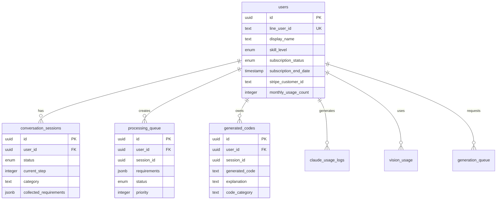

# データベーススキーマ仕様書 - GAS Generator

## 概要
Supabase（PostgreSQL）を使用したデータベース設計の詳細仕様書です。

## テーブル構成

### 1. users（ユーザー）
ユーザー情報を管理するマスターテーブル。

| カラム名 | 型 | NULL | デフォルト | 説明 |
|---------|-----|------|-----------|------|
| id | uuid | NO | gen_random_uuid() | 主キー |
| line_user_id | text | NO | - | LINE User ID（一意制約） |
| display_name | text | YES | NULL | LINE表示名 |
| skill_level | enum | NO | 'beginner' | スキルレベル（beginner/intermediate/advanced） |
| subscription_status | enum | NO | 'free' | サブスクリプション状態（free/premium） |
| subscription_end_date | timestamp | YES | NULL | サブスクリプション終了日時 |
| subscription_started_at | timestamp | YES | NULL | サブスクリプション開始日時 |
| subscription_cancelled_at | timestamp | YES | NULL | サブスクリプションキャンセル日時 |
| stripe_customer_id | text | YES | NULL | Stripe顧客ID |
| refund_processed_at | timestamp | YES | NULL | 返金処理日時 |
| monthly_usage_count | integer | NO | 0 | 月間使用回数 |
| total_requests | integer | NO | 0 | 総リクエスト数 |
| last_reset_date | timestamp | YES | NULL | 使用回数リセット日 |
| last_active_at | timestamp | NO | now() | 最終アクティブ日時 |
| created_at | timestamp | NO | now() | 作成日時 |
| updated_at | timestamp | NO | now() | 更新日時 |

**インデックス**:
- PRIMARY KEY (id)
- UNIQUE (line_user_id)
- INDEX (subscription_status)
- INDEX (last_active_at)

**トリガー**:
- updated_at自動更新トリガー

---

### 2. conversation_sessions（会話セッション）
ユーザーとの会話状態を管理。

| カラム名 | 型 | NULL | デフォルト | 説明 |
|---------|-----|------|-----------|------|
| id | uuid | NO | gen_random_uuid() | 主キー |
| user_id | uuid | NO | - | ユーザーID（外部キー） |
| status | enum | NO | 'active' | セッション状態 |
| current_step | integer | NO | 1 | 現在のステップ |
| category | text | YES | NULL | カテゴリ |
| subcategory | text | YES | NULL | サブカテゴリ |
| collected_requirements | jsonb | NO | '{}' | 収集した要件 |
| created_at | timestamp | NO | now() | 作成日時 |
| updated_at | timestamp | NO | now() | 更新日時 |

**ステータス値**:
- `active`: アクティブ
- `ready_for_generation`: 生成準備完了
- `completed`: 完了
- `abandoned`: 放棄

**インデックス**:
- PRIMARY KEY (id)
- FOREIGN KEY (user_id) REFERENCES users(id)
- INDEX (user_id, status)
- INDEX (created_at)

---

### 3. processing_queue（処理キュー）
コード生成タスクのキュー管理。

| カラム名 | 型 | NULL | デフォルト | 説明 |
|---------|-----|------|-----------|------|
| id | uuid | NO | gen_random_uuid() | 主キー |
| user_id | uuid | NO | - | ユーザーID（外部キー） |
| line_user_id | text | NO | - | LINE User ID |
| session_id | uuid | NO | - | セッションID |
| requirements | jsonb | NO | - | 要件データ |
| status | enum | NO | 'pending' | ステータス |
| priority | integer | NO | 0 | 優先度（高い値が優先） |
| retry_count | integer | NO | 0 | リトライ回数 |
| max_retries | integer | NO | 3 | 最大リトライ回数 |
| created_at | timestamp | NO | now() | 作成日時 |
| started_at | timestamp | YES | NULL | 処理開始日時 |
| completed_at | timestamp | YES | NULL | 処理完了日時 |
| error_message | text | YES | NULL | エラーメッセージ |

**ステータス値**:
- `pending`: 待機中
- `processing`: 処理中
- `completed`: 完了
- `failed`: 失敗

**インデックス**:
- PRIMARY KEY (id)
- FOREIGN KEY (user_id) REFERENCES users(id)
- INDEX (status, priority DESC, created_at)
- INDEX (user_id)
- INDEX (created_at)

---

### 4. generated_codes（生成コード）
生成されたGASコードの履歴。

| カラム名 | 型 | NULL | デフォルト | 説明 |
|---------|-----|------|-----------|------|
| id | uuid | NO | gen_random_uuid() | 主キー |
| user_id | uuid | NO | - | ユーザーID（外部キー） |
| session_id | uuid | NO | - | セッションID |
| requirements_summary | text | NO | - | 要件サマリー |
| generated_code | text | NO | - | 生成されたコード |
| explanation | text | NO | - | コードの説明 |
| usage_steps | text[] | NO | - | 使用手順 |
| code_category | text | NO | - | コードカテゴリ |
| code_subcategory | text | YES | NULL | コードサブカテゴリ |
| claude_prompt | text | NO | - | Claude APIプロンプト |
| claude_response_metadata | jsonb | YES | NULL | Claude APIレスポンスメタデータ |
| user_feedback | text | YES | NULL | ユーザーフィードバック |
| created_at | timestamp | NO | now() | 作成日時 |

**インデックス**:
- PRIMARY KEY (id)
- FOREIGN KEY (user_id) REFERENCES users(id)
- INDEX (user_id, created_at DESC)
- INDEX (code_category)
- INDEX (created_at)

---

### 5. claude_usage_logs（Claude使用ログ）
Claude API使用状況の記録。

| カラム名 | 型 | NULL | デフォルト | 説明 |
|---------|-----|------|-----------|------|
| id | uuid | NO | gen_random_uuid() | 主キー |
| user_id | uuid | YES | NULL | ユーザーID（外部キー） |
| request_type | text | NO | - | リクエストタイプ |
| input_tokens | integer | NO | 0 | 入力トークン数 |
| output_tokens | integer | NO | 0 | 出力トークン数 |
| estimated_cost | decimal | NO | 0 | 推定コスト（円） |
| success | boolean | NO | - | 成功フラグ |
| error_type | text | YES | NULL | エラータイプ |
| processing_time_ms | integer | YES | NULL | 処理時間（ミリ秒） |
| created_at | timestamp | NO | now() | 作成日時 |

**インデックス**:
- PRIMARY KEY (id)
- FOREIGN KEY (user_id) REFERENCES users(id)
- INDEX (user_id)
- INDEX (created_at)
- INDEX (request_type)

---

### 6. vision_usage（Vision API使用履歴）
画像解析の使用履歴。

| カラム名 | 型 | NULL | デフォルト | 説明 |
|---------|-----|------|-----------|------|
| id | uuid | NO | gen_random_uuid() | 主キー |
| user_id | uuid | NO | - | ユーザーID（外部キー） |
| image_hash | text | NO | - | 画像ハッシュ |
| analysis_result | text | NO | - | 解析結果 |
| status | enum | NO | 'processing' | ステータス |
| image_size_bytes | integer | YES | NULL | 画像サイズ（バイト） |
| processing_time_ms | integer | YES | NULL | 処理時間（ミリ秒） |
| created_at | timestamp | NO | now() | 作成日時 |
| updated_at | timestamp | YES | NULL | 更新日時 |

**ステータス値**:
- `processing`: 処理中
- `completed`: 完了
- `failed`: 失敗

**インデックス**:
- PRIMARY KEY (id)
- FOREIGN KEY (user_id) REFERENCES users(id)
- INDEX (user_id, created_at DESC)
- INDEX (image_hash)

---

### 7. stripe_events（Stripeイベント）
Stripeイベントの重複処理防止用。

| カラム名 | 型 | NULL | デフォルト | 説明 |
|---------|-----|------|-----------|------|
| id | uuid | NO | gen_random_uuid() | 主キー |
| event_id | text | NO | - | StripeイベントID（一意制約） |
| event_type | text | NO | - | イベントタイプ |
| processed_at | timestamp | NO | - | 処理日時 |
| created_at | timestamp | NO | now() | 作成日時 |

**インデックス**:
- PRIMARY KEY (id)
- UNIQUE (event_id)
- INDEX (created_at)

---

### 8. refunds（返金記録）
返金処理の記録。

| カラム名 | 型 | NULL | デフォルト | 説明 |
|---------|-----|------|-----------|------|
| id | uuid | NO | gen_random_uuid() | 主キー |
| charge_id | text | NO | - | Stripe Charge ID |
| amount | integer | NO | - | 返金額（円） |
| customer_id | text | YES | NULL | Stripe顧客ID |
| refunded_at | timestamp | NO | - | 返金日時 |
| created_at | timestamp | NO | now() | 作成日時 |

**インデックス**:
- PRIMARY KEY (id)
- INDEX (charge_id)
- INDEX (customer_id)
- INDEX (created_at)

---

### 9. generation_queue（生成キュー）
コード生成要求の待ち行列。

| カラム名 | 型 | NULL | デフォルト | 説明 |
|---------|-----|------|-----------|------|
| id | uuid | NO | gen_random_uuid() | 主キー |
| user_id | uuid | NO | - | ユーザーID（外部キー） |
| category | text | NO | - | カテゴリ |
| requirements | jsonb | NO | - | 要件 |
| status | enum | NO | 'pending' | ステータス |
| created_at | timestamp | NO | now() | 作成日時 |
| updated_at | timestamp | YES | NULL | 更新日時 |

**ステータス値**:
- `pending`: 待機中
- `processing`: 処理中
- `completed`: 完了
- `failed`: 失敗

**インデックス**:
- PRIMARY KEY (id)
- FOREIGN KEY (user_id) REFERENCES users(id)
- INDEX (status, created_at)
- INDEX (user_id)

---

### 10. system_metrics（システムメトリクス）
システムパフォーマンス指標の記録。

| カラム名 | 型 | NULL | デフォルト | 説明 |
|---------|-----|------|-----------|------|
| id | uuid | NO | gen_random_uuid() | 主キー |
| metric_type | text | NO | - | メトリクスタイプ |
| metric_value | decimal | NO | - | メトリクス値 |
| metadata | jsonb | YES | NULL | メタデータ |
| recorded_at | timestamp | NO | now() | 記録日時 |

**メトリクスタイプ例**:
- `response_time`: レスポンスタイム
- `queue_length`: キュー長
- `error_rate`: エラー率
- `memory_usage`: メモリ使用率
- `active_users`: アクティブユーザー数

**インデックス**:
- PRIMARY KEY (id)
- INDEX (metric_type, recorded_at DESC)
- INDEX (recorded_at)

---

## リレーション図



---

## データ保持ポリシー

### 保持期間

| テーブル | 保持期間 | クリーンアップ頻度 |
|---------|---------|-----------------|
| users | 永続 | - |
| conversation_sessions | 30日（abandoned） | 毎日 |
| processing_queue | 7日（completed/failed） | 毎日 |
| generated_codes | 90日 | 毎週 |
| claude_usage_logs | 180日 | 毎月 |
| vision_usage | 90日 | 毎週 |
| stripe_events | 30日 | 毎日 |
| refunds | 永続 | - |
| generation_queue | 3日（completed/failed） | 毎日 |
| system_metrics | 30日 | 毎日 |

### クリーンアップSQL例

```sql
-- 古いセッションの削除
DELETE FROM conversation_sessions 
WHERE status = 'abandoned' 
  AND updated_at < NOW() - INTERVAL '30 days';

-- 処理済みキューの削除
DELETE FROM processing_queue 
WHERE status IN ('completed', 'failed') 
  AND completed_at < NOW() - INTERVAL '7 days';

-- 古いメトリクスの削除
DELETE FROM system_metrics 
WHERE recorded_at < NOW() - INTERVAL '30 days';
```

---

## パフォーマンス最適化

### インデックス戦略

1. **頻繁な検索カラムにインデックス**
   - user_id（外部キー）
   - status（ステータス検索）
   - created_at（時系列検索）

2. **複合インデックス**
   ```sql
   CREATE INDEX idx_queue_status_priority 
   ON processing_queue(status, priority DESC, created_at);
   
   CREATE INDEX idx_user_sessions 
   ON conversation_sessions(user_id, status);
   ```

3. **部分インデックス**
   ```sql
   -- アクティブなキューのみ
   CREATE INDEX idx_active_queue 
   ON processing_queue(created_at) 
   WHERE status IN ('pending', 'processing');
   ```

### パーティショニング

大規模テーブルのパーティション戦略：

```sql
-- claude_usage_logsを月別パーティション
CREATE TABLE claude_usage_logs_2025_01 
PARTITION OF claude_usage_logs 
FOR VALUES FROM ('2025-01-01') TO ('2025-02-01');
```

---

## セキュリティ

### Row Level Security (RLS)

```sql
-- usersテーブルのRLS
ALTER TABLE users ENABLE ROW LEVEL SECURITY;

CREATE POLICY "Users can view own data" ON users
  FOR SELECT USING (auth.uid() = id);

CREATE POLICY "Users can update own data" ON users
  FOR UPDATE USING (auth.uid() = id);
```

### 暗号化

- **転送時**: SSL/TLS
- **保存時**: Supabase自動暗号化
- **機密データ**: stripe_customer_idなどは別途暗号化

---

## バックアップとリカバリ

### バックアップ戦略

1. **自動バックアップ**
   - 毎日: フルバックアップ
   - 毎時: インクリメンタル

2. **手動バックアップ**
   ```sql
   pg_dump -h db.supabase.co -U postgres -d gas_generator > backup.sql
   ```

3. **Point-in-Time Recovery**
   - 最大7日前まで復元可能

### リストア手順

```bash
# フルリストア
psql -h db.supabase.co -U postgres -d gas_generator < backup.sql

# 特定テーブルのリストア
psql -h db.supabase.co -U postgres -d gas_generator \
  -c "TRUNCATE TABLE users CASCADE;"
psql -h db.supabase.co -U postgres -d gas_generator < users_backup.sql
```

---

## マイグレーション

### マイグレーション管理

```bash
# 新規マイグレーション作成
supabase migration new add_user_preferences

# マイグレーション適用
supabase migration up

# ロールバック
supabase migration down
```

### サンプルマイグレーション

```sql
-- migrations/20250109_add_user_preferences.sql
CREATE TABLE user_preferences (
  id UUID PRIMARY KEY DEFAULT gen_random_uuid(),
  user_id UUID REFERENCES users(id) ON DELETE CASCADE,
  theme TEXT DEFAULT 'light',
  notifications_enabled BOOLEAN DEFAULT true,
  created_at TIMESTAMP WITH TIME ZONE DEFAULT NOW(),
  updated_at TIMESTAMP WITH TIME ZONE DEFAULT NOW()
);

CREATE INDEX idx_user_preferences_user 
ON user_preferences(user_id);

CREATE TRIGGER update_user_preferences_updated_at
BEFORE UPDATE ON user_preferences
FOR EACH ROW
EXECUTE FUNCTION update_updated_at_column();
```

---

## モニタリング

### 重要なクエリ

```sql
-- アクティブユーザー数
SELECT COUNT(DISTINCT user_id) 
FROM conversation_sessions 
WHERE created_at > NOW() - INTERVAL '24 hours';

-- キュー処理状況
SELECT status, COUNT(*) 
FROM processing_queue 
GROUP BY status;

-- エラー率
SELECT 
  DATE_TRUNC('hour', created_at) as hour,
  COUNT(CASE WHEN success = false THEN 1 END)::float / COUNT(*) as error_rate
FROM claude_usage_logs
WHERE created_at > NOW() - INTERVAL '24 hours'
GROUP BY hour
ORDER BY hour DESC;
```

---

## 最適化のベストプラクティス

1. **N+1問題の回避**
   - JOINを使用して関連データを一度に取得

2. **バッチ処理**
   - 大量のINSERT/UPDATEはバッチで実行

3. **接続プーリング**
   - Supabaseの接続プーラーを使用

4. **キャッシュ戦略**
   - 頻繁にアクセスされるデータはアプリケーション層でキャッシュ

5. **非正規化**
   - パフォーマンスが重要な場合は適度な非正規化を検討

---

*この仕様書は定期的に更新されます。最新版はGitHubリポジトリを参照してください。*