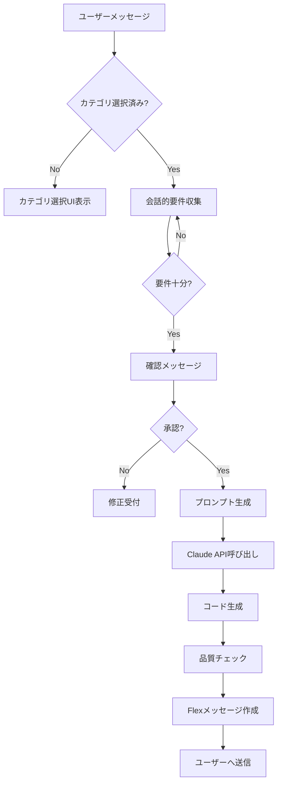

# 🚀 GAS Generator - システム仕様書

## 目次
1. [概要](#概要)
2. [システムアーキテクチャ](#システムアーキテクチャ)
3. [技術スタック](#技術スタック)
4. [ディレクトリ構造](#ディレクトリ構造)
5. [主要コンポーネント](#主要コンポーネント)
6. [API仕様](#api仕様)
7. [データベース設計](#データベース設計)
8. [外部連携](#外部連携)
9. [ビジネスロジック](#ビジネスロジック)
10. [セキュリティ](#セキュリティ)
11. [エラー処理](#エラー処理)
12. [パフォーマンス最適化](#パフォーマンス最適化)
13. [デプロイメント](#デプロイメント)

---

## 概要

### システム名
**GAS Generator** - Google Apps Script自動生成AIボット

### 目的
LINE経由でユーザーからの要望を受け取り、Claude AIを使用してGoogle Apps Script（GAS）のコードを自動生成し、提供するシステム。

### 主要機能
- 🤖 自然言語での対話型要件収集
- 📸 画像解析によるスプレッドシート構造認識
- 🎯 カテゴリ別GASコード生成
- 💎 プレミアムプラン（Stripe決済）
- 📊 使用量トラッキング・制限
- 🔄 非同期処理キュー

### ターゲットユーザー
- プログラミング初心者～中級者
- 業務効率化を求めるビジネスユーザー
- スプレッドシート自動化に興味がある人

---

## システムアーキテクチャ

### 全体構成図
```
┌─────────────────────────────────────────────────────────────┐
│                         ユーザー                             │
└──────────────────────┬──────────────────────────────────────┘
                       │
                       ▼
┌─────────────────────────────────────────────────────────────┐
│                      LINE Platform                          │
│  ├─ Messaging API                                           │
│  └─ Webhook                                                │
└──────────────────────┬──────────────────────────────────────┘
                       │
                       ▼
┌─────────────────────────────────────────────────────────────┐
│                   Next.js Application                       │
│  ┌──────────────────────────────────────────────────────┐   │
│  │                  API Routes Layer                    │   │
│  │  ├─ /api/webhook (LINE Webhook受信)                  │   │
│  │  ├─ /api/stripe/webhook (決済Webhook)               │   │
│  │  ├─ /api/cron/* (定期処理)                          │   │
│  │  └─ /api/admin/* (管理API)                          │   │
│  └──────────────────────────────────────────────────────┘   │
│                                                             │
│  ┌──────────────────────────────────────────────────────┐   │
│  │               Business Logic Layer                   │   │
│  │  ├─ Conversation Flow Manager                        │   │
│  │  ├─ Code Generation Service                         │   │
│  │  ├─ Image Analysis Service                          │   │
│  │  ├─ Queue Processing Service                        │   │
│  │  └─ Premium Management Service                      │   │
│  └──────────────────────────────────────────────────────┘   │
│                                                             │
│  ┌──────────────────────────────────────────────────────┐   │
│  │                  Data Access Layer                   │   │
│  │  ├─ Supabase Client                                 │   │
│  │  ├─ Session Store                                   │   │
│  │  └─ Cache Manager                                   │   │
│  └──────────────────────────────────────────────────────┘   │
└─────────────────────────────────────────────────────────────┘
                       │
         ┌─────────────┼─────────────┬──────────────┐
         ▼             ▼             ▼              ▼
┌──────────────┐ ┌──────────┐ ┌──────────┐ ┌──────────────┐
│  Supabase    │ │Claude AI │ │  Stripe  │ │Vision API    │
│  Database    │ │   API    │ │   API    │ │(Claude 3.5)  │
└──────────────┘ └──────────┘ └──────────┘ └──────────────┘
```

### レイヤー設計

#### 1. Presentation Layer（プレゼンテーション層）
- LINE Messaging API インターフェース
- Webhook エンドポイント
- 管理用API

#### 2. Application Layer（アプリケーション層）
- 会話フロー管理
- コード生成オーケストレーション
- 画像解析処理
- キュー管理

#### 3. Domain Layer（ドメイン層）
- ユーザーエンティティ
- セッションエンティティ
- コード生成ルール
- 料金計算ロジック

#### 4. Infrastructure Layer（インフラ層）
- データベースアクセス
- 外部API通信
- キャッシュ管理
- ファイルストレージ

---

## 技術スタック

### フロントエンド
```json
{
  "framework": "Next.js 14.0.0",
  "language": "TypeScript 5.x",
  "runtime": "Node.js 18.x",
  "styling": "Tailwind CSS (未使用)",
  "ui": "LINE Messaging API (チャットUI)"
}
```

### バックエンド
```json
{
  "api": "Next.js API Routes",
  "runtime": "Node.js (Serverless)",
  "edge": "Edge Runtime (Stripe Webhook)",
  "queue": "In-memory + Database Queue"
}
```

### データベース
```json
{
  "primary": "Supabase (PostgreSQL)",
  "cache": "In-memory Cache",
  "session": "Memory + Database Hybrid"
}
```

### 外部サービス
```json
{
  "ai": "Anthropic Claude 3.5 Sonnet",
  "vision": "Claude 3.5 Vision API",
  "messaging": "LINE Messaging API",
  "payment": "Stripe",
  "hosting": "Vercel/Render/Railway"
}
```

### 開発ツール
```json
{
  "packageManager": "npm",
  "linter": "ESLint",
  "typeCheck": "TypeScript",
  "validation": "Zod",
  "build": "Next.js Build"
}
```

---

## ディレクトリ構造

```
gas-generator/
├── app/                          # Next.js App Router
│   ├── api/                      # APIエンドポイント
│   │   ├── webhook/              # LINE Webhook
│   │   ├── stripe/               # Stripe Webhook
│   │   ├── cron/                 # 定期実行ジョブ
│   │   ├── admin/                # 管理API
│   │   └── health/               # ヘルスチェック
│   ├── layout.tsx                # ルートレイアウト
│   └── page.tsx                  # ホームページ
│
├── lib/                          # ビジネスロジック
│   ├── claude/                   # Claude AI関連
│   │   ├── client.ts             # APIクライアント
│   │   ├── prompt-builder.ts     # プロンプト構築
│   │   ├── response-parser.ts    # レスポンス解析
│   │   └── usage-tracker.ts      # 使用量追跡
│   │
│   ├── conversation/             # 会話管理
│   │   ├── conversational-flow.ts # 会話フロー
│   │   ├── session-store.ts      # セッション管理
│   │   ├── session-handler.ts    # セッションハンドラ
│   │   ├── flow-manager.ts       # フロー制御
│   │   └── category-definitions.ts # カテゴリ定義
│   │
│   ├── line/                     # LINE関連
│   │   ├── client.ts             # LINE APIクライアント
│   │   ├── message-templates.ts  # メッセージテンプレート
│   │   ├── image-handler.ts      # 画像処理
│   │   ├── webhook-validator.ts  # Webhook検証
│   │   ├── engineer-support.ts   # エンジニアサポート
│   │   └── flex-code-template.ts # Flexメッセージ
│   │
│   ├── vision/                   # 画像解析
│   │   ├── rate-limiter.ts       # レート制限
│   │   └── memory-counter.ts     # メモリカウンタ
│   │
│   ├── queue/                    # キュー管理
│   │   ├── manager.ts            # キューマネージャー
│   │   └── processor.ts          # ジョブプロセッサー
│   │
│   ├── supabase/                 # データベース
│   │   ├── client.ts             # Supabaseクライアント
│   │   ├── queries.ts            # クエリ集
│   │   └── session-queries.ts    # セッションクエリ
│   │
│   ├── premium/                  # プレミアム機能
│   │   └── premium-checker.ts    # プレミアムチェック
│   │
│   ├── middleware/               # ミドルウェア
│   │   ├── rate-limiter.ts       # レート制限
│   │   └── request-logger.ts     # リクエストログ
│   │
│   ├── utils/                    # ユーティリティ
│   │   ├── logger.ts             # ロガー
│   │   ├── errors.ts             # エラークラス
│   │   ├── crypto.ts             # 暗号化
│   │   ├── validators.ts         # バリデータ
│   │   └── memory-manager.ts     # メモリ管理
│   │
│   ├── monitoring/               # 監視
│   │   ├── performance.ts        # パフォーマンス
│   │   └── error-notifier.ts     # エラー通知
│   │
│   └── constants/                # 定数
│       └── config.ts             # 設定値
│
├── types/                        # 型定義
│   ├── database.ts               # DB型定義
│   ├── claude.ts                 # Claude型定義
│   └── line.ts                   # LINE型定義
│
├── scripts/                      # スクリプト
│   └── seed-data.ts              # シードデータ
│
└── public/                       # 静的ファイル
    └── (空)
```

---

## 主要コンポーネント

### 1. 会話フロー管理システム

#### ConversationalFlow クラス
```typescript
class ConversationalFlow {
  // 自然言語での対話的要件収集
  static async processConversation(
    context: ConversationContext,
    userMessage: string
  ): Promise<{
    reply: string
    isComplete: boolean
    updatedContext: ConversationContext
  }>
  
  // カテゴリ別の質問テンプレート管理
  // AIによる動的な質問生成
  // 要件の自動抽出と整理
}
```

**特徴:**
- JSONレスポンス強制を廃止し、自然な対話を実現
- `[READY_FOR_CODE]` マーカーによる状態管理
- コンテキスト保持による継続的な会話

### 2. コード生成エンジン

#### PromptBuilder クラス
```typescript
class PromptBuilder {
  // トークン制限を考慮したプロンプト構築
  static async buildCodeGenerationPrompt(
    request: CodeGenerationRequest
  ): Promise<string>
  
  // ユーザーの過去実績を考慮
  // カテゴリ別の最適化
  // 800トークン以内での効率的な指示
}
```

**プロンプト構成:**
1. システムプロンプト（固定、800トークン）
2. ユーザーコンテキスト（400トークン以内）
3. カテゴリコンテキスト（300トークン以内）
4. リクエスト詳細（300トークン以内）

### 3. 画像解析システム

#### LineImageHandler クラス
```typescript
class LineImageHandler {
  // Claude Vision APIを使用した画像解析
  async handleImageMessage(
    messageId: string,
    replyToken: string,
    userId: string
  ): Promise<{
    success: boolean
    description?: string
    error?: string
  }>
  
  // レート制限（無料：3回/日、プレミアム：100回/日）
  // 画像ハッシュによる重複チェック
  // 5MB以下の画像サイズ制限
}
```

**対応画像形式:**
- JPEG, PNG, GIF, WebP
- BMP, TIFF (JPEGに変換)
- HEIC, HEIF (JPEGに変換)

### 4. セッション管理

#### ConversationSessionStore クラス
```typescript
class ConversationSessionStore {
  // シングルトンパターン
  private static instance: ConversationSessionStore
  
  // ハイブリッドストレージ（メモリ + DB）
  private sessions: Map<string, SessionData>
  private timerManager: TimerManager
  
  // 15分のタイムアウト
  // 自動クリーンアップ
}
```

**セッション状態:**
- `waiting_category`: カテゴリ選択待ち
- `collecting_requirements`: 要件収集中
- `ready_for_generation`: 生成準備完了
- `completed`: 完了

### 5. キュー処理システム

#### QueueManager クラス
```typescript
class QueueManager {
  // 非同期ジョブ管理
  static async addJob(jobData: QueueJob): Promise<string>
  
  // バッチ処理（最大5件同時）
  static async processBatch(): Promise<ProcessResult[]>
  
  // 優先度管理（premium > free）
  // リトライ機能（最大3回）
  // デッドロック検出と解決
}
```

### 6. レート制限

#### VisionRateLimiter クラス
```typescript
class VisionRateLimiter {
  // Mutexによるレースコンディション対策
  private mutex = new Mutex()
  private memoryCounter = MemoryUsageCounter.getInstance()
  
  // 制限設定
  FREE: { daily: 3, monthly: 20 }
  PREMIUM: { daily: 100, monthly: 1500 }
  
  // プレースホルダー作成でロールバック可能
}
```

---

## API仕様

### 1. LINE Webhook エンドポイント

#### POST `/api/webhook`
LINEからのWebhookイベントを受信・処理

**Headers:**
```
x-line-signature: [署名]
Content-Type: application/json
```

**Request Body:**
```json
{
  "destination": "U...",
  "events": [{
    "type": "message",
    "message": {
      "type": "text",
      "text": "スプレッドシートを自動化したい"
    },
    "source": {
      "userId": "U[32文字の16進数]",
      "type": "user"
    },
    "replyToken": "...",
    "timestamp": 1234567890
  }]
}
```

**Response:**
```json
{
  "success": true,
  "processedEvents": 1
}
```

**処理フロー:**
1. 署名検証
2. イベント重複チェック
3. レート制限チェック
4. ユーザー作成/更新
5. セッション管理
6. メッセージタイプ別処理
   - テキスト: 会話フロー処理
   - 画像: Vision API解析
   - ファイル: 形式チェック

### 2. Stripe Webhook

#### POST `/api/stripe/webhook`
Stripe決済イベントを処理

**Runtime:** Edge Runtime（高速処理）

**イベントタイプ:**
- `checkout.session.completed`: 決済完了
- `customer.subscription.created`: サブスク開始
- `customer.subscription.updated`: サブスク更新
- `customer.subscription.deleted`: サブスク解約
- `charge.refunded`: 返金処理

**冪等性保証:**
- イベントIDによる重複チェック
- 処理済みフラグ管理

### 3. 定期実行ジョブ

#### GET `/api/cron/cleanup`
古いデータのクリーンアップ

**実行頻度:** 毎日午前3時（JST）

**処理内容:**
- 7日以上前のセッション削除
- 30日以上前のログ削除
- 完了済みキューの削除

#### GET `/api/cron/process-queue`
キュー処理の実行

**実行頻度:** 1分ごと

**処理内容:**
- 待機中ジョブの取得（最大5件）
- 並列処理実行
- エラーハンドリングとリトライ

### 4. 管理API

#### GET `/api/admin/vision-stats`
画像解析の統計情報取得

**Response:**
```json
{
  "daily": {
    "total": 150,
    "free": 30,
    "premium": 120
  },
  "monthly": {
    "total": 3500,
    "revenue": 45000
  },
  "topUsers": [...]
}
```

### 5. ヘルスチェック

#### GET `/api/health`
システム稼働状態の確認

**Response:**
```json
{
  "status": "healthy",
  "timestamp": "2025-09-09T12:00:00Z",
  "services": {
    "database": "connected",
    "claude": "available",
    "line": "active"
  }
}
```

---

## データベース設計

### テーブル構造

#### 1. users テーブル
ユーザー情報管理

```sql
CREATE TABLE users (
  id UUID PRIMARY KEY DEFAULT gen_random_uuid(),
  line_user_id VARCHAR(255) UNIQUE,
  display_name VARCHAR(255),
  skill_level VARCHAR(50) DEFAULT 'beginner',
  subscription_status VARCHAR(50) DEFAULT 'free',
  subscription_end_date TIMESTAMP,
  stripe_customer_id VARCHAR(255),
  monthly_usage_count INT DEFAULT 0,
  total_requests INT DEFAULT 0,
  created_at TIMESTAMP DEFAULT NOW(),
  last_active_at TIMESTAMP DEFAULT NOW()
);
```

#### 2. sessions テーブル
会話セッション管理

```sql
CREATE TABLE sessions (
  id UUID PRIMARY KEY DEFAULT gen_random_uuid(),
  user_id UUID REFERENCES users(id),
  status VARCHAR(50) DEFAULT 'active',
  step_data JSONB,
  category VARCHAR(100),
  subcategory VARCHAR(100),
  requirements JSONB,
  started_at TIMESTAMP DEFAULT NOW(),
  updated_at TIMESTAMP DEFAULT NOW(),
  completed_at TIMESTAMP
);
```

#### 3. generated_codes テーブル
生成コード履歴

```sql
CREATE TABLE generated_codes (
  id UUID PRIMARY KEY DEFAULT gen_random_uuid(),
  user_id UUID REFERENCES users(id),
  session_id UUID REFERENCES sessions(id),
  code TEXT NOT NULL,
  gas_url TEXT,
  category VARCHAR(100),
  subcategory VARCHAR(100),
  requirements JSONB,
  quality_score FLOAT,
  user_feedback VARCHAR(50),
  created_at TIMESTAMP DEFAULT NOW()
);
```

#### 4. vision_usage テーブル
画像解析使用履歴

```sql
CREATE TABLE vision_usage (
  id UUID PRIMARY KEY DEFAULT gen_random_uuid(),
  user_id VARCHAR(255) NOT NULL,
  image_hash VARCHAR(64),
  analysis_result TEXT,
  status VARCHAR(50) DEFAULT 'processing',
  metadata JSONB,
  created_at TIMESTAMP DEFAULT NOW(),
  INDEX idx_user_created (user_id, created_at),
  INDEX idx_hash_status (image_hash, status)
);
```

#### 5. generation_queue テーブル
非同期処理キュー

```sql
CREATE TABLE generation_queue (
  id UUID PRIMARY KEY DEFAULT gen_random_uuid(),
  user_id VARCHAR(255) NOT NULL,
  job_type VARCHAR(50) NOT NULL,
  payload JSONB NOT NULL,
  status VARCHAR(50) DEFAULT 'pending',
  priority INT DEFAULT 1,
  retry_count INT DEFAULT 0,
  max_retries INT DEFAULT 3,
  error_message TEXT,
  created_at TIMESTAMP DEFAULT NOW(),
  processed_at TIMESTAMP,
  completed_at TIMESTAMP,
  INDEX idx_status_priority (status, priority DESC, created_at)
);
```

#### 6. stripe_events テーブル
Stripe イベント履歴

```sql
CREATE TABLE stripe_events (
  id VARCHAR(255) PRIMARY KEY,
  type VARCHAR(100) NOT NULL,
  data JSONB NOT NULL,
  processed BOOLEAN DEFAULT false,
  created_at TIMESTAMP DEFAULT NOW(),
  processed_at TIMESTAMP
);
```

### インデックス戦略

**パフォーマンス最適化のためのインデックス:**
- `users.line_user_id`: ユニークインデックス（高速検索）
- `sessions.user_id + status`: 複合インデックス
- `vision_usage.user_id + created_at`: 日次集計用
- `generation_queue.status + priority`: キュー処理用

---

## 外部連携

### 1. LINE Messaging API

#### 接続設定
```typescript
{
  channelAccessToken: process.env.LINE_CHANNEL_ACCESS_TOKEN,
  channelSecret: process.env.LINE_CHANNEL_SECRET
}
```

#### 主要機能
- **メッセージ送信**: Reply API / Push API
- **リッチメニュー**: カテゴリ選択UI
- **Flexメッセージ**: コード表示用カード
- **クイックリプライ**: 選択肢提示

#### レート制限
- Reply: 無制限（30秒以内）
- Push: 500通/分
- Multicast: 500宛先/リクエスト

### 2. Anthropic Claude API

#### モデル設定
```typescript
{
  model: 'claude-3-5-sonnet-20241022',
  maxTokens: 4000,
  temperature: 0.7
}
```

#### 使用用途
- **テキスト生成**: GASコード生成
- **Vision API**: 画像解析（スプレッドシート認識）
- **会話AI**: 自然な対話での要件収集

#### コスト管理
- Input: $0.003 / 1Kトークン
- Output: $0.015 / 1Kトークン
- Vision: 約$0.02 / 画像

### 3. Stripe API

#### 料金プラン
```typescript
{
  free: {
    price: 0,
    limits: {
      dailyGeneration: 3,
      monthlyGeneration: 20,
      imageAnalysis: 3
    }
  },
  premium: {
    price: 1500, // 円
    limits: {
      dailyGeneration: 無制限,
      monthlyGeneration: 無制限,
      imageAnalysis: 100
    }
  }
}
```

#### 決済フロー
1. Checkout Session作成
2. 決済ページへリダイレクト
3. Webhook受信
4. サブスクリプション有効化

### 4. Supabase

#### 接続設定
```typescript
{
  url: process.env.NEXT_PUBLIC_SUPABASE_URL,
  anonKey: process.env.NEXT_PUBLIC_SUPABASE_ANON_KEY,
  serviceRoleKey: process.env.SUPABASE_SERVICE_ROLE_KEY
}
```

#### 機能利用
- **Database**: PostgreSQL
- **Auth**: 未使用（LINE認証を使用）
- **Storage**: 未使用
- **Realtime**: 未使用

---

## ビジネスロジック

### 1. コード生成フロー



### 2. カテゴリ別処理

#### スプレッドシート操作
- データ集計・分析
- 自動転記・整形
- レポート生成
- グラフ作成

#### Gmail連携
- 自動返信
- 添付ファイル処理
- メール転送
- 定期送信

#### カレンダー連携
- 予定自動作成
- リマインダー設定
- 参加者管理
- 定期予定設定

#### API連携
- Slack通知
- LINE通知
- 外部データ取得
- Webhook処理

### 3. 料金計算ロジック

#### 無料プラン制限
```typescript
const FREE_LIMITS = {
  daily: {
    generation: 3,
    imageAnalysis: 3
  },
  monthly: {
    generation: 20,
    imageAnalysis: 20
  }
}
```

#### プレミアム特典
- 無制限のコード生成
- 優先処理キュー
- 画像解析100回/日
- エンジニアサポート

### 4. 品質スコアリング

```typescript
interface QualityMetrics {
  hasErrorHandling: boolean      // try-catch実装
  hasComments: boolean            // コメント記載
  hasLogging: boolean             // ログ出力
  isEfficient: boolean            // 効率的な実装
  followsBestPractices: boolean   // ベストプラクティス準拠
}

// スコア計算（0-100）
const calculateScore = (metrics: QualityMetrics): number => {
  let score = 0
  if (metrics.hasErrorHandling) score += 25
  if (metrics.hasComments) score += 20
  if (metrics.hasLogging) score += 15
  if (metrics.isEfficient) score += 20
  if (metrics.followsBestPractices) score += 20
  return score
}
```

---

## セキュリティ

### 1. 認証・認可

#### LINE署名検証
```typescript
async function validateLineSignature(
  body: string, 
  signature: string
): Promise<boolean> {
  const channelSecret = process.env.LINE_CHANNEL_SECRET
  const expectedSignature = crypto
    .createHmac('SHA256', channelSecret)
    .update(body)
    .digest('base64')
  return timingSafeEqual(signature, expectedSignature)
}
```

#### Stripe Webhook検証
```typescript
stripe.webhooks.constructEvent(
  rawBody,
  signature,
  webhookSecret
)
```

### 2. レート制限

#### 実装方式
- **Mutex**: レースコンディション対策
- **Token Bucket**: APIレート制限
- **Sliding Window**: 時間窓制限

#### 制限設定
```typescript
const RATE_LIMITS = {
  api: {
    webhook: '100/minute',
    generation: '10/minute',
    imageAnalysis: '5/minute'
  },
  user: {
    free: '3/day',
    premium: '100/day'
  }
}
```

### 3. データ保護

#### 暗号化
- **通信**: HTTPS/TLS 1.3
- **データベース**: Supabase暗号化
- **API Key**: 環境変数管理

#### 個人情報管理
- LINE User IDのみ保存
- 実名・メールアドレス非保存
- GDPR/個人情報保護法準拠

### 4. インジェクション対策

#### SQLインジェクション
```typescript
// Supabase Prepared Statements使用
supabaseAdmin
  .from('users')
  .select('*')
  .eq('line_user_id', userId) // 自動エスケープ
```

#### コードインジェクション
```typescript
// ユーザー入力のサニタイズ
function sanitizeUserInput(input: string): string {
  return input
    .replace(/[<>]/g, '')
    .replace(/javascript:/gi, '')
    .substring(0, 2000)
}
```

### 5. エラーメッセージの安全性

```typescript
// 本番環境では詳細を隠蔽
export function getSafeErrorMessage(error: unknown): string {
  if (process.env.NODE_ENV === 'development') {
    return error.message
  }
  
  // 汎用メッセージ返却
  return 'エラーが発生しました'
}
```

---

## エラー処理

### 1. エラー階層

```typescript
BaseError
├── ValidationError (400)
├── AuthenticationError (401)
├── AuthorizationError (403)
├── NotFoundError (404)
├── RateLimitError (429)
├── ConfigurationError (500)
├── ExternalServiceError (502)
└── DatabaseError (500)
```

### 2. エラーハンドリング戦略

#### グローバルエラーハンドラ
```typescript
process.on('uncaughtException', (error) => {
  logger.critical('Uncaught exception', { error })
  // Graceful shutdown
})

process.on('unhandledRejection', (reason) => {
  logger.critical('Unhandled rejection', { reason })
})
```

#### API レスポンス
```typescript
catch (error) {
  const handled = handleError(error)
  
  return NextResponse.json(
    {
      error: getSafeErrorMessage(error),
      code: handled.code
    },
    { status: handled.statusCode }
  )
}
```

### 3. リトライ戦略

```typescript
class RetryHandler {
  async withRetry<T>(
    fn: () => Promise<T>,
    options: {
      maxAttempts: 3,
      delay: 1000,
      backoff: 2,
      retryOn: [NetworkError, TimeoutError]
    }
  ): Promise<T>
}
```

### 4. エラー通知

```typescript
class ErrorNotifier {
  // 重要度別通知
  severity: {
    low: 'ログのみ',
    medium: 'メトリクス記録',
    high: '管理者通知',
    critical: '即時アラート'
  }
  
  // 通知チャネル
  channels: ['console', 'database', 'line_admin']
}
```

---

## パフォーマンス最適化

### 1. キャッシュ戦略

#### メモリキャッシュ
```typescript
class CacheManager {
  private cache = new Map<string, CacheEntry>()
  
  strategies: {
    'conversation-sessions': { ttl: 900000 },  // 15分
    'user-data': { ttl: 3600000 },            // 1時間
    'generated-codes': { ttl: 86400000 }      // 24時間
  }
}
```

#### データベースキャッシュ
- セッション: 15分タイムアウト
- ユーザー情報: 1時間キャッシュ
- 生成コード: 24時間保持

### 2. 非同期処理

#### キューシステム
```typescript
class QueueProcessor {
  // バッチ処理
  batchSize: 5
  
  // 並列実行
  concurrency: 3
  
  // 優先度管理
  priority: ['premium', 'normal', 'low']
}
```

### 3. データベース最適化

#### クエリ最適化
```typescript
// N+1問題の回避
const users = await supabase
  .from('users')
  .select(`
    *,
    sessions (
      *,
      generated_codes (*)
    )
  `)
  .limit(100)
```

#### インデックス活用
- 複合インデックス使用
- 部分インデックス適用
- カバリングインデックス

### 4. メモリ管理

#### ガベージコレクション
```typescript
class MemoryManager {
  // 定期的なクリーンアップ
  cleanupInterval: 300000  // 5分
  
  // メモリ使用量監視
  threshold: 0.8  // 80%で警告
  
  // 自動スケーリング
  maxMemory: 400  // MB
}
```

### 5. レスポンス最適化

#### ストリーミング
```typescript
// 大きなレスポンスの分割送信
const stream = new ReadableStream({
  async start(controller) {
    for await (const chunk of generateCode()) {
      controller.enqueue(chunk)
    }
    controller.close()
  }
})
```

---

## デプロイメント

### 1. 環境変数

#### 必須環境変数
```env
# LINE
LINE_CHANNEL_ACCESS_TOKEN=
LINE_CHANNEL_SECRET=

# Anthropic
ANTHROPIC_API_KEY=

# Supabase
NEXT_PUBLIC_SUPABASE_URL=
NEXT_PUBLIC_SUPABASE_ANON_KEY=
SUPABASE_SERVICE_ROLE_KEY=

# Stripe
STRIPE_SECRET_KEY=
STRIPE_WEBHOOK_SECRET=

# Application
NODE_ENV=production
WEBHOOK_SECRET=
```

### 2. ビルド設定

#### Next.js設定
```javascript
// next.config.js
module.exports = {
  experimental: {
    serverActions: true
  },
  images: {
    domains: ['profile.line-scdn.net']
  }
}
```

#### TypeScript設定
```json
{
  "compilerOptions": {
    "target": "ES2020",
    "module": "esnext",
    "strict": true,
    "esModuleInterop": true,
    "skipLibCheck": true
  }
}
```

### 3. デプロイプラットフォーム

#### Vercel
```yaml
Build Command: npm run build
Output Directory: .next
Install Command: npm install
```

#### Render
```yaml
Build Command: npm install && npm run build
Start Command: npm start
Health Check Path: /api/health
```

#### Railway
```yaml
Builder: Nixpacks
Start Command: npm start
Health Check: /api/health
```

### 4. 本番環境考慮事項

#### スケーリング
- 水平スケーリング対応
- ステートレス設計
- セッション外部化

#### 監視
- ヘルスチェック実装
- エラー追跡
- パフォーマンスメトリクス

#### バックアップ
- データベース日次バックアップ
- コード履歴30日保持
- 設定ファイルバージョン管理

### 5. CI/CD パイプライン

```yaml
# GitHub Actions例
name: Deploy
on:
  push:
    branches: [main]

jobs:
  deploy:
    runs-on: ubuntu-latest
    steps:
      - uses: actions/checkout@v2
      - uses: actions/setup-node@v2
      - run: npm ci
      - run: npm run build
      - run: npm run test
      - run: vercel --prod
```

---

## 運用・保守

### 1. 監視項目

#### システムメトリクス
- CPU使用率
- メモリ使用量
- レスポンスタイム
- エラー率

#### ビジネスメトリクス
- DAU/MAU
- コード生成数
- 課金率
- 離脱率

### 2. アラート設定

```typescript
const ALERT_THRESHOLDS = {
  errorRate: 0.01,       // 1%
  responseTime: 3000,    // 3秒
  memoryUsage: 0.8,      // 80%
  queueSize: 100         // 100件
}
```

### 3. メンテナンス

#### 定期メンテナンス
- セキュリティパッチ適用
- 依存関係更新
- データベース最適化
- ログローテーション

#### 緊急対応
- インシデント対応フロー
- ロールバック手順
- データリカバリ手順

### 4. ドキュメント管理

- API仕様書
- データベース設計書
- 運用手順書
- トラブルシューティングガイド

---

## まとめ

GAS Generatorは、LINEを通じてユーザーと自然な対話を行いながら、Google Apps Scriptのコードを自動生成する革新的なシステムです。

### 技術的特徴
- 🏗️ **モダンアーキテクチャ**: Next.js 14 + TypeScript
- 🤖 **AI駆動**: Claude 3.5 Sonnet
- 📊 **スケーラブル**: Serverless + Edge Runtime
- 🔒 **セキュア**: 多層防御セキュリティ
- ⚡ **高性能**: キャッシュ + 非同期処理

### ビジネス価値
- 💰 **収益化**: Stripeサブスクリプション
- 📈 **成長性**: 機能拡張容易
- 🎯 **ユーザー体験**: 自然な対話UI
- 🔄 **自動化**: 業務効率化支援

このシステムは、技術的に堅牢でありながら、ビジネス要件も満たす完成度の高いソリューションとなっています。

---

*最終更新: 2025年9月9日*
*バージョン: 1.0.0*