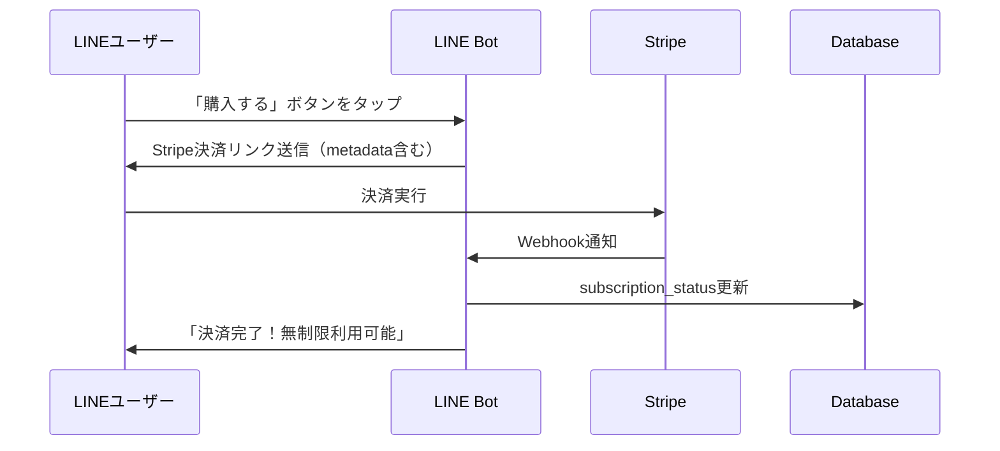

# 決済連携システム実装ガイド

## 1. システム概要
Stripe決済とLINEユーザーを紐付けて、有料会員に無制限アクセスを提供するシステム

## 2. 実装フロー

### Step 1: Stripeでの設定
1. Stripe Dashboardにログイン
2. 「Webhooks」設定から以下のエンドポイントを追加：
   - URL: `https://gasgenerator.onrender.com/api/stripe/webhook`
   - イベント: `checkout.session.completed`, `customer.subscription.created`, `customer.subscription.deleted`

### Step 2: データベーススキーマ更新

```sql
-- usersテーブルに追加するカラム
ALTER TABLE users ADD COLUMN stripe_customer_id VARCHAR(255);
ALTER TABLE users ADD COLUMN subscription_status VARCHAR(50) DEFAULT 'free';
ALTER TABLE users ADD COLUMN subscription_id VARCHAR(255);
ALTER TABLE users ADD COLUMN subscription_end_date TIMESTAMP;
ALTER TABLE users ADD COLUMN monthly_usage_count INTEGER DEFAULT 0;
ALTER TABLE users ADD COLUMN last_reset_date DATE DEFAULT CURRENT_DATE;

-- 決済履歴テーブル
CREATE TABLE payment_history (
  id UUID DEFAULT gen_random_uuid() PRIMARY KEY,
  user_id UUID REFERENCES users(id),
  stripe_payment_intent_id VARCHAR(255),
  amount INTEGER,
  status VARCHAR(50),
  created_at TIMESTAMP DEFAULT NOW()
);
```

### Step 3: 決済フロー



## 3. 実装コード

### A. Stripe Webhook処理 (/api/stripe/webhook/route.ts)

```typescript
import Stripe from 'stripe'
import { NextRequest, NextResponse } from 'next/server'
import { supabaseAdmin } from '@/lib/supabase/client'

const stripe = new Stripe(process.env.STRIPE_SECRET_KEY!, {
  apiVersion: '2024-06-20'
})

const endpointSecret = process.env.STRIPE_WEBHOOK_SECRET!

export async function POST(req: NextRequest) {
  const sig = req.headers.get('stripe-signature')!
  const body = await req.text()

  let event: Stripe.Event

  try {
    event = stripe.webhooks.constructEvent(body, sig, endpointSecret)
  } catch (err) {
    return NextResponse.json({ error: 'Webhook Error' }, { status: 400 })
  }

  switch (event.type) {
    case 'checkout.session.completed':
      const session = event.data.object as Stripe.Checkout.Session
      
      // metadata からLINE User IDを取得
      const lineUserId = session.metadata?.line_user_id
      
      if (lineUserId) {
        // ユーザーのsubscription_statusを更新
        await supabaseAdmin
          .from('users')
          .update({
            stripe_customer_id: session.customer as string,
            subscription_status: 'premium',
            subscription_id: session.subscription as string,
            subscription_end_date: new Date(Date.now() + 30 * 24 * 60 * 60 * 1000).toISOString()
          })
          .eq('line_user_id', lineUserId)
      }
      break

    case 'customer.subscription.deleted':
      const subscription = event.data.object as Stripe.Subscription
      
      // サブスクリプションキャンセル時の処理
      await supabaseAdmin
        .from('users')
        .update({
          subscription_status: 'free',
          subscription_id: null
        })
        .eq('stripe_customer_id', subscription.customer as string)
      break
  }

  return NextResponse.json({ received: true })
}
```

### B. 決済リンク生成の改善

```typescript
// lib/line/message-templates.ts に追加
static createPaymentLink(lineUserId: string): string {
  // LINE User IDをBase64エンコード
  const encoded = Buffer.from(lineUserId).toString('base64')
  
  // StripeのCheckout SessionにメタデータとしてLINE User IDを含める
  // Stripe Dashboardで Payment Linkを作成時に以下を設定：
  // 1. URLパラメータを許可
  // 2. client_reference_idを有効化
  
  return `https://buy.stripe.com/7sY3cv2So0v78ICbSz6oo09?client_reference_id=${encoded}`
}
```

### C. 利用制限チェック

```typescript
// app/api/webhook/route.ts の修正
async function checkUserLimits(user: any): Promise<boolean> {
  // プレミアムユーザーは無制限
  if (user.subscription_status === 'premium') {
    return true
  }
  
  // 無料ユーザーは月10回まで
  const today = new Date()
  const lastReset = new Date(user.last_reset_date || today)
  
  // 月が変わったらリセット
  if (today.getMonth() !== lastReset.getMonth()) {
    await supabaseAdmin
      .from('users')
      .update({
        monthly_usage_count: 0,
        last_reset_date: today.toISOString()
      })
      .eq('id', user.id)
    
    user.monthly_usage_count = 0
  }
  
  return user.monthly_usage_count < 10
}

// processWebhookEvent内で使用
const canUse = await checkUserLimits(user)
if (!canUse) {
  await lineClient.replyMessage(replyToken, [{
    type: 'text',
    text: '📊 無料プランの月間利用回数（10回）に達しました。\n\n有料プラン（¥10,000/月）で無制限利用が可能です！',
    quickReply: {
      items: [{
        type: 'action',
        action: {
          type: 'uri',
          label: '💳 今すぐ購入',
          uri: MessageTemplates.createPaymentLink(lineUserId)
        }
      }]
    }
  }])
  return { replied: true, queued: false, sessionUpdated: false }
}
```

## 4. 環境変数の追加

```env
# .env.local に追加
STRIPE_SECRET_KEY=sk_live_xxxxx
STRIPE_WEBHOOK_SECRET=whsec_xxxxx
STRIPE_PRICE_ID=price_xxxxx
```

## 5. 実装手順

1. **Supabaseでスキーマ更新**
   - 上記SQLを実行してテーブル構造を更新

2. **Stripeの設定**
   - Webhook設定
   - Payment LinkにLINE User IDを渡せるように設定

3. **コード実装**
   - Stripe Webhook endpoint作成
   - 利用制限チェック機能追加
   - 決済リンク生成の改善

4. **テスト**
   - Stripe CLIでローカルテスト
   - 本番環境でEnd-to-Endテスト

## 6. 運用フロー

1. ユーザーがLINEで「購入」ボタンタップ
2. LINE User ID付きのStripe決済リンクを送信
3. ユーザーが決済完了
4. Stripe WebhookでLINE User IDとStripe Customer IDを紐付け
5. DBのsubscription_statusを「premium」に更新
6. 以降、そのユーザーは無制限利用可能

## 7. 管理画面で確認すべき項目

- Stripe Dashboard: 決済状況、サブスクリプション管理
- Supabase Dashboard: ユーザーのsubscription_status確認
- Render Logs: Webhook処理のログ確認