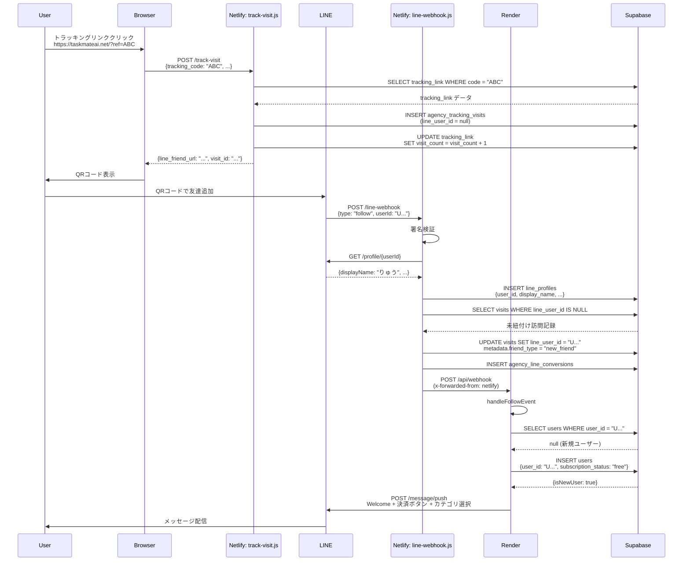
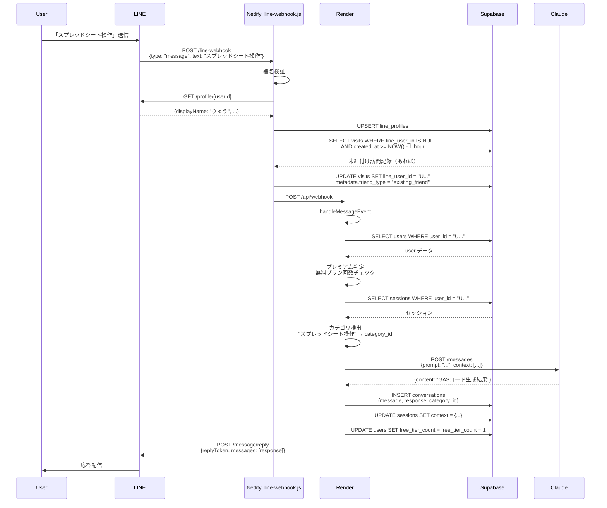
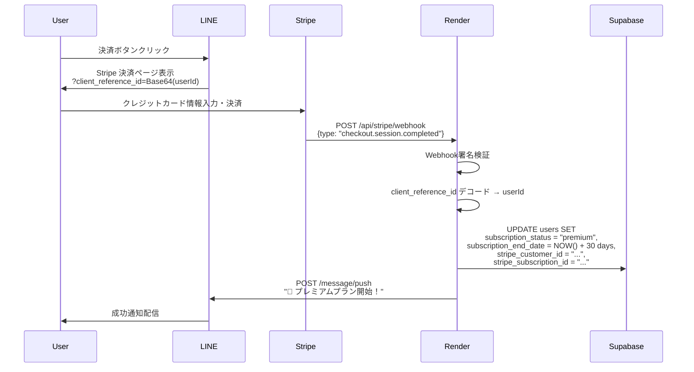

# TaskMate AI システムアーキテクチャ設計書

**最終更新:** 2024-10-23
**バージョン:** 2.0

---

## 目次

1. [システム概要](#1-システム概要)
2. [全体アーキテクチャ](#2-全体アーキテクチャ)
3. [Render側機能詳細](#3-render側機能詳細)
4. [Netlify側機能詳細](#4-netlify側機能詳細)
5. [データベース設計](#5-データベース設計)
6. [主要処理フロー](#6-主要処理フロー)
7. [環境変数一覧](#7-環境変数一覧)
8. [デプロイ手順](#8-デプロイ手順)
9. [トラブルシューティング](#9-トラブルシューティング)

---

## 1. システム概要

### 1.1 プロダクト概要

**TaskMate AI** は、LINE Bot として動作する GAS（Google Apps Script）コード自動生成サービス。

**主要機能:**
- LINE Bot による対話型コード生成
- 代理店トラッキングシステム（流入元・成果測定）
- Stripe 決済連携（プレミアムプラン）
- 無料プラン・プレミアムプランの管理
- Claude AI による高品質コード生成

### 1.2 技術スタック

| レイヤー | 技術 | 用途 |
|---------|------|------|
| **メインアプリ** | Next.js 14 (App Router) | TaskMate AI 本体 |
| **ホスティング** | Render (Web Service) | Next.js デプロイ先 |
| **サブシステム** | Netlify Functions | LINE Webhook 転送 & トラッキング |
| **データベース** | Supabase (PostgreSQL) | ユーザー・訪問・決済データ |
| **AI エンジン** | Anthropic Claude API | コード生成 |
| **決済** | Stripe | サブスクリプション管理 |
| **メッセージング** | LINE Messaging API | ユーザー対話 |

### 1.3 システム構成の特徴

**なぜ Render と Netlify の 2 層構成？**

```
LINE API → Netlify Functions → Render (Next.js)
```

**理由:**
1. **Webhook 転送による分離**: LINE Webhook を Netlify で受けて Render に転送
2. **トラッキング機能の独立**: 代理店トラッキングを Netlify で処理
3. **スケーラビリティ**: トラッキング負荷と本体負荷の分離
4. **デプロイ速度**: Netlify Functions は即座にデプロイ、Render はビルド時間が長い

---

## 2. 全体アーキテクチャ

### 2.1 システム構成図

```
┌─────────────────────────────────────────────────────────────┐
│                         LINE Platform                        │
│  - Messaging API                                             │
│  - Webhook Events (follow, message, unfollow)                │
└────────────────────┬────────────────────────────────────────┘
                     │
                     │ HTTPS Webhook
                     ▼
┌─────────────────────────────────────────────────────────────┐
│              Netlify Functions (Serverless)                  │
│                                                              │
│  ┌─────────────────────────────────────────────────────┐   │
│  │ line-webhook.js                                     │   │
│  │ - LINE イベント受信                                 │   │
│  │ - 署名検証                                           │   │
│  │ - Follow/Message イベント処理                       │   │
│  │ - LINE Profile UPSERT                               │   │
│  │ - 訪問記録紐付け                                     │   │
│  │ - Render へ転送                                      │   │
│  └─────────────────────────────────────────────────────┘   │
│                                                              │
│  ┌─────────────────────────────────────────────────────┐   │
│  │ track-visit.js                                      │   │
│  │ - トラッキングリンク訪問記録                         │   │
│  │ - IP/User-Agent 解析                                │   │
│  │ - デバイス情報抽出                                   │   │
│  └─────────────────────────────────────────────────────┘   │
│                                                              │
│  ┌─────────────────────────────────────────────────────┐   │
│  │ get-tracking-stats.js                               │   │
│  │ - 代理店の訪問統計取得                               │   │
│  │ - LINE 名・友達タイプ判定                            │   │
│  └─────────────────────────────────────────────────────┘   │
│                                                              │
│  ┌─────────────────────────────────────────────────────┐   │
│  │ get-master-agency.js                                │   │
│  │ - マスター代理店情報取得                             │   │
│  └─────────────────────────────────────────────────────┘   │
└────────────────┬────────────────────────────────────────────┘
                 │
                 │ HTTPS Forward
                 ▼
┌─────────────────────────────────────────────────────────────┐
│              Render (Next.js 14 App Router)                  │
│                                                              │
│  ┌─────────────────────────────────────────────────────┐   │
│  │ app/api/webhook/route.ts                            │   │
│  │ - LINE Webhook メイン処理                           │   │
│  │ - Follow Event → Welcome Message                    │   │
│  │ - Message Event → Claude AI 処理                    │   │
│  │ - Image Event → 画像解析                             │   │
│  │ - 無限ループ防止                                     │   │
│  │ - レート制限                                         │   │
│  │ - スパム検出                                         │   │
│  └─────────────────────────────────────────────────────┘   │
│                                                              │
│  ┌─────────────────────────────────────────────────────┐   │
│  │ app/api/stripe/webhook/route.ts                     │   │
│  │ - Stripe Webhook 処理                               │   │
│  │ - 決済完了 → プレミアム有効化                        │   │
│  │ - サブスク更新・キャンセル処理                       │   │
│  └─────────────────────────────────────────────────────┘   │
│                                                              │
│  ┌─────────────────────────────────────────────────────┐   │
│  │ app/api/health/route.ts                             │   │
│  │ - ヘルスチェック API                                 │   │
│  │ - DB/Redis/LINE API 接続確認                        │   │
│  └─────────────────────────────────────────────────────┘   │
│                                                              │
│  ┌─────────────────────────────────────────────────────┐   │
│  │ app/api/admin/tracking-links/route.ts               │   │
│  │ - トラッキングリンク CRUD API                        │   │
│  └─────────────────────────────────────────────────────┘   │
└────────────────┬────────────────────────────────────────────┘
                 │
                 │ SQL Queries
                 ▼
┌─────────────────────────────────────────────────────────────┐
│                    Supabase (PostgreSQL)                     │
│                                                              │
│  - users                    (ユーザー情報)                   │
│  - line_profiles            (LINE プロフィール)              │
│  - agencies                 (代理店情報)                     │
│  - agency_tracking_links    (トラッキングリンク)             │
│  - agency_tracking_visits   (訪問記録)                      │
│  - agency_line_conversions  (LINE 友達追加 CV)               │
│  - conversations            (会話履歴)                       │
│  - sessions                 (セッション)                     │
└─────────────────────────────────────────────────────────────┘

┌─────────────────────────────────────────────────────────────┐
│                       External APIs                          │
│                                                              │
│  - Anthropic Claude API     (コード生成)                     │
│  - Stripe API               (決済処理)                       │
│  - LINE Messaging API       (メッセージ送信)                 │
└─────────────────────────────────────────────────────────────┘
```

### 2.2 データフロー

#### ユーザー友達追加時のフロー

```
1. ユーザーが LINE で友達追加
   ↓
2. LINE Platform が Webhook を送信
   ↓
3. Netlify: line-webhook.js が受信
   - 署名検証
   - Follow Event 処理
   - LINE Profile 取得 & DB 保存
   - Render へ転送
   ↓
4. Render: route.ts/handleFollowEvent が処理
   - ユーザー作成・更新
   - isNewUser フラグ判定
   - Welcome Message 送信（新規/既存で分岐）
   ↓
5. LINE Platform 経由でユーザーにメッセージ配信
```

#### トラッキングリンク経由の友達追加フロー

```
1. ユーザーが代理店のトラッキングリンクをクリック
   https://taskmateai.net/?ref=AGENCY_ABC
   ↓
2. フロントエンド (tracking.js) が Netlify へ POST
   ↓
3. Netlify: track-visit.js が訪問記録作成
   - tracking_code: AGENCY_ABC
   - visitor_ip, user_agent, device_type, os, browser
   - line_user_id: null (未追加)
   ↓
4. QR コード表示 → ユーザーが LINE 友達追加
   ↓
5. Netlify: line-webhook.js/handleFollowEvent
   - LINE Profile 保存
   - linkUserToTracking で訪問記録に line_user_id を紐付け
   - metadata.friend_type = 'new_friend'
   ↓
6. Render: route.ts/handleFollowEvent
   - Welcome Message 送信
   ↓
7. ユーザーがメッセージ送信
   ↓
8. Netlify: line-webhook.js/handleMessageEvent
   - LINE Profile UPSERT（既存友達対応）
   - 過去1時間の未紐付け訪問記録検索
   - 見つかれば紐付け (metadata.friend_type = 'existing_friend')
```

---

## 3. Render側機能詳細

### 3.1 ディレクトリ構成

```
gas-generator/
├── app/
│   ├── api/
│   │   ├── webhook/
│   │   │   └── route.ts          # LINE Webhook メイン処理
│   │   ├── stripe/
│   │   │   └── webhook/
│   │   │       └── route.ts      # Stripe Webhook 処理
│   │   ├── health/
│   │   │   └── route.ts          # ヘルスチェック
│   │   └── admin/
│   │       └── tracking-links/
│   │           └── route.ts      # トラッキングリンク管理
│   └── page.tsx                  # ランディングページ
├── lib/
│   ├── line/
│   │   ├── client.ts             # LINE API クライアント
│   │   ├── message-templates.ts  # メッセージテンプレート
│   │   └── engineer-support.ts   # エンジニアサポート機能
│   ├── supabase/
│   │   ├── queries.ts            # データベースクエリ
│   │   └── transaction.ts        # トランザクション処理
│   ├── claude/
│   │   └── client.ts             # Claude API クライアント
│   ├── conversation/
│   │   ├── conversational-flow.ts  # 会話フロー管理
│   │   ├── session-manager.ts      # セッション管理
│   │   └── category-detector.ts    # カテゴリ検出
│   ├── premium/
│   │   └── premium-checker.ts    # プレミアムユーザー判定
│   └── middleware/
│       ├── rate-limiter.ts       # レート制限
│       └── spam-detector.ts      # スパム検出
└── package.json
```

### 3.2 主要ファイル詳細

#### 3.2.1 app/api/webhook/route.ts

**役割:** LINE Webhook のメイン処理を担当

**主要な関数:**

##### POST Handler
```typescript
export async function POST(request: NextRequest): Promise<NextResponse>
```

**処理内容:**
1. **無限ループ防止**: `x-forwarded-from` ヘッダーチェック
2. **署名検証**: LINE からの正規リクエストか確認
3. **重複イベント検出**: 同一イベントの多重処理防止
4. **イベント振り分け**: follow/message/unfollow/image に応じて処理

**データベース操作:**
- なし（イベントハンドラに委譲）

---

##### handleFollowEvent
```typescript
async function handleFollowEvent(event: any): Promise<void>
```

**処理内容:**
1. **ユーザー作成・更新**: `UserQueries.createOrUpdate(userId)`
2. **isNewUser 判定**: 新規友達 or ブロック解除
3. **プレミアム判定**: サブスク状態確認
4. **メッセージ送信分岐**:
   - プレミアム: "おかえりなさい！"
   - 新規無料: Welcome + 決済ボタン + カテゴリ選択（3メッセージ）
   - 既存無料: "おかえりなさい！" + カテゴリ選択のみ

**データベース操作:**
- **SELECT**: `users` テーブルから既存ユーザー検索
- **INSERT/UPDATE**: `users` テーブルにユーザー作成・更新
- **返り値**: `{ ...user, isNewUser: true/false }`

**LINE API 呼び出し:**
- `lineClient.pushMessage(userId, messages)`
- 戻り値が `false` の場合は例外を投げる（エラー可視化）

**重要な修正履歴:**
- **2024-10-23**: `pushMessage` の戻り値チェックを追加（サイレント失敗防止）
- **2024-10-22**: `isNewUser` フラグ追加（既存友達へのスパム防止）

---

##### handleMessageEvent
```typescript
async function handleMessageEvent(event: any, requestId: string): Promise<void>
```

**処理内容:**
1. **レート制限チェック**: 短時間の連続メッセージをブロック
2. **スパム検出**: 同一メッセージの繰り返しを検出
3. **プレミアムユーザー判定**: 無料プラン制限チェック
4. **セッション管理**: 会話コンテキストの取得
5. **カテゴリ検出**: "スプレッドシート操作" → category_id 変換
6. **Claude AI 処理**: コード生成
7. **応答送信**: LINE に返信

**データベース操作:**
- **SELECT**: `users`, `sessions` から情報取得
- **INSERT**: `conversations` に会話履歴保存
- **UPDATE**: `sessions` のコンテキスト更新
- **カウント更新**: 無料プランの利用回数更新

**LINE API 呼び出し:**
- `lineClient.replyMessage(replyToken, messages)`
- `lineClient.showLoadingAnimation(userId, 20)` （処理中アニメーション）

---

##### handleImageEvent
```typescript
async function processImageMessage(event: any, requestId: string): Promise<boolean>
```

**処理内容:**
1. **画像取得**: LINE API から画像バイナリ取得
2. **Base64 エンコード**: Claude API 用フォーマット
3. **Claude Vision API**: 画像解析
4. **応答生成**: 解析結果をテキストで返信

**データベース操作:**
- **SELECT**: `users` から情報取得
- **INSERT**: `conversations` に画像メッセージ保存

**LINE API 呼び出し:**
- `GET https://api-data.line.me/v2/bot/message/{messageId}/content`
- `lineClient.replyMessage(replyToken, [response])`

---

#### 3.2.2 app/api/stripe/webhook/route.ts

**役割:** Stripe の決済イベントを処理

**主要イベント:**

##### checkout.session.completed
```typescript
// 決済完了時の処理
```

**処理内容:**
1. **LINE User ID デコード**: `client_reference_id` から復号
2. **プレミアム有効化**: `users.subscription_status = 'premium'`
3. **サブスク期間設定**: `subscription_end_date` を30日後に設定
4. **成功メッセージ送信**: LINE でプレミアム開始通知

**データベース操作:**
- **UPDATE**: `users` テーブル
  ```sql
  UPDATE users SET
    subscription_status = 'premium',
    subscription_end_date = NOW() + INTERVAL '30 days',
    stripe_customer_id = '...',
    stripe_subscription_id = '...',
    updated_at = NOW()
  WHERE user_id = '...'
  ```

---

##### customer.subscription.updated
```typescript
// サブスク更新時の処理
```

**処理内容:**
- サブスク状態変更の反映（active/canceled/past_due）

---

##### customer.subscription.deleted
```typescript
// サブスクキャンセル時の処理
```

**処理内容:**
1. **プレミアム解除**: `subscription_status = 'free'`
2. **通知送信**: キャンセル確認メッセージ

---

#### 3.2.3 lib/line/client.ts

**役割:** LINE Messaging API のラッパークラス

**主要メソッド:**

##### pushMessage
```typescript
async pushMessage(userId: string, messages: any[]): Promise<boolean>
```

**処理内容:**
1. **API リクエスト**: `POST https://api.line.me/v2/bot/message/push`
2. **エラーハンドリング**: ステータスコードに応じた処理
3. **戻り値**: 成功=`true`, 失敗=`false`

**重要な仕様:**
- **最大5メッセージ**: LINE API の制限
- **タイムアウト**: 5秒（`TIMEOUTS.HTTP_REQUEST`）
- **エラー時**: ログ出力して `false` を返す（例外を投げない）

**エラーケース:**
- **401**: `LINE_CHANNEL_ACCESS_TOKEN` が無効
- **400**: メッセージフォーマットエラー
- **429**: レート制限超過

---

##### replyMessage
```typescript
async replyMessage(replyToken: string, messages: any[]): Promise<boolean>
```

**処理内容:**
- `POST https://api.line.me/v2/bot/message/reply`
- 5メッセージ超過時は残りを `pushMessage` で送信

---

##### showLoadingAnimation
```typescript
async showLoadingAnimation(userId: string, durationSeconds: number = 20): Promise<boolean>
```

**処理内容:**
- `POST https://api.line.me/v2/bot/chat/loading/start`
- 最大60秒のローディング表示

---

#### 3.2.4 lib/supabase/queries.ts

**役割:** データベースクエリのカプセル化

**主要クラス:**

##### UserQueries.createOrUpdate
```typescript
static async createOrUpdate(userId: string)
```

**処理内容:**
1. **既存ユーザー検索**:
   ```sql
   SELECT * FROM users WHERE user_id = $1
   ```
2. **既存の場合**: `last_active_at` 更新 → `{ ...user, isNewUser: false }`
3. **新規の場合**: INSERT → `{ ...user, isNewUser: true }`

**返り値:**
```typescript
{
  user_id: string,
  subscription_status: 'free' | 'premium',
  subscription_end_date: string | null,
  isNewUser: boolean,  // 重要！
  ...
}
```

**データベーススキーマ:**
```sql
CREATE TABLE users (
  user_id TEXT PRIMARY KEY,
  subscription_status TEXT DEFAULT 'free',
  subscription_end_date TIMESTAMP,
  stripe_customer_id TEXT,
  stripe_subscription_id TEXT,
  free_tier_count INTEGER DEFAULT 0,
  last_active_at TIMESTAMP DEFAULT NOW(),
  created_at TIMESTAMP DEFAULT NOW(),
  updated_at TIMESTAMP DEFAULT NOW()
);
```

---

#### 3.2.5 lib/conversation/session-manager.ts

**役割:** ユーザーのセッション管理

**主要メソッド:**

##### getSession
```typescript
async getSession(userId: string): Promise<Session | null>
```

**処理内容:**
1. **メモリキャッシュ確認**: Redis ライクなインメモリキャッシュ
2. **DB から取得**: キャッシュミス時
   ```sql
   SELECT * FROM sessions WHERE user_id = $1
   ```
3. **キャッシュ更新**: 取得したセッションをメモリに保存

---

##### updateSession
```typescript
async updateSession(userId: string, updates: Partial<Session>): Promise<void>
```

**処理内容:**
1. **DB 更新**:
   ```sql
   UPDATE sessions SET
     context = $1,
     category_id = $2,
     updated_at = NOW()
   WHERE user_id = $3
   ```
2. **キャッシュ更新**: メモリキャッシュも同期

---

### 3.3 環境変数（Render）

| 変数名 | 用途 | 例 |
|--------|------|-----|
| `LINE_CHANNEL_ACCESS_TOKEN` | LINE API 認証 | `eyJhbG...` |
| `LINE_CHANNEL_SECRET` | Webhook 署名検証 | `abc123...` |
| `SUPABASE_URL` | Supabase 接続先 | `https://xxx.supabase.co` |
| `SUPABASE_SERVICE_ROLE_KEY` | Supabase 管理権限キー | `eyJhbG...` |
| `ANTHROPIC_API_KEY` | Claude API キー | `sk-ant-...` |
| `STRIPE_SECRET_KEY` | Stripe API キー | `sk_live_...` |
| `STRIPE_WEBHOOK_SECRET` | Stripe Webhook 署名 | `whsec_...` |
| `NODE_OPTIONS` | Node.js ヒープサイズ | `--max-old-space-size=1536` |

---

## 4. Netlify側機能詳細

### 4.1 ディレクトリ構成

```
netlify-tracking/
├── netlify/
│   └── functions/
│       ├── line-webhook.js         # LINE Webhook 転送
│       ├── track-visit.js          # 訪問記録作成
│       ├── get-tracking-stats.js   # 統計取得
│       └── get-master-agency.js    # マスター代理店取得
├── admin/
│   ├── index.html                  # 代理店管理画面
│   ├── dashboard.js                # 管理画面ロジック
│   └── login.html                  # ログイン画面
├── public/
│   ├── index.html                  # ランディングページ
│   └── tracking.js                 # トラッキングスクリプト
└── netlify.toml                    # Netlify 設定
```

### 4.2 主要ファイル詳細

#### 4.2.1 netlify/functions/line-webhook.js

**役割:** LINE Webhook を受信し、Render に転送する中継点

**主要な関数:**

##### exports.handler
```javascript
exports.handler = async (event, context)
```

**処理フロー:**
1. **CORS 処理**: OPTIONS リクエスト対応
2. **署名検証**: `x-line-signature` 検証
3. **イベント振り分け**:
   - `follow` → `handleFollowEvent`
   - `message` → `handleMessageEvent`
   - `unfollow` → `handleUnfollowEvent`
4. **Render 転送**: `await forwardToRender(body, signature)`

**重要な修正履歴:**
- **2024-10-21**: `await forwardToRender` に修正（非同期完了待機）

---

##### handleFollowEvent
```javascript
async function handleFollowEvent(event)
```

**処理内容:**
1. **LINE Profile 取得**: `getLineUserProfile(userId)`
2. **DB に保存**:
   ```sql
   INSERT INTO line_profiles (user_id, display_name, picture_url, ...)
   VALUES ($1, $2, $3, ...)
   ```
3. **訪問記録紐付け**: `linkUserToTracking(userId, userId, 'new_friend')`

**データベース操作:**
- **INSERT**: `line_profiles` テーブル

---

##### handleMessageEvent
```javascript
async function handleMessageEvent(event)
```

**処理内容:**
1. **LINE Profile UPSERT**:
   ```sql
   INSERT INTO line_profiles (user_id, display_name, ...)
   VALUES ($1, $2, ...)
   ON CONFLICT (user_id) DO UPDATE SET
     display_name = EXCLUDED.display_name,
     updated_at = NOW()
   ```
2. **未紐付け訪問記録検索**:
   ```sql
   SELECT * FROM agency_tracking_visits
   WHERE line_user_id IS NULL
   AND created_at >= NOW() - INTERVAL '1 hour'
   ORDER BY created_at DESC
   LIMIT 5
   ```
3. **訪問記録紐付け**:
   ```sql
   UPDATE agency_tracking_visits SET
     line_user_id = $1,
     metadata = jsonb_set(metadata, '{friend_type}', '"existing_friend"')
   WHERE id = $2
   ```

**重要な修正履歴:**
- **2024-10-23**: `updated_at` カラム削除（存在しないためエラー）
- **2024-10-22**: UPSERT 追加（既存友達の LINE 名記録）

---

##### forwardToRender
```javascript
async function forwardToRender(body, signature)
```

**処理内容:**
1. **無限ループ防止**: `x-forwarded-from: netlify` ヘッダー追加
2. **Render へ POST**: `https://gasgenerator.onrender.com/api/webhook`
3. **タイムアウト**: 28秒（Netlify Functions の制限内）

**重要な修正:**
- **必ず `await` すること**: 関数終了前にリクエスト完了を待つ

---

##### linkUserToTracking
```javascript
async function linkUserToTracking(lineUserId, sessionUserId, friendType)
```

**処理内容:**
1. **未紐付け訪問記録検索**:
   ```sql
   SELECT * FROM agency_tracking_visits
   WHERE line_user_id IS NULL
   ORDER BY created_at DESC
   LIMIT 5
   ```
2. **紐付け更新**:
   ```sql
   UPDATE agency_tracking_visits SET
     line_user_id = $1,
     metadata = jsonb_set(metadata, '{friend_type}', '$2')
   WHERE id = $3
   ```
3. **コンバージョン記録作成**:
   ```sql
   INSERT INTO agency_line_conversions (
     agency_id, tracking_link_id, visit_id, line_user_id, converted_at
   ) VALUES ($1, $2, $3, $4, NOW())
   ```

---

#### 4.2.2 netlify/functions/track-visit.js

**役割:** トラッキングリンクの訪問記録を作成

**処理フロー:**

```javascript
exports.handler = async (event, context)
```

1. **トラッキングコード検証**:
   ```sql
   SELECT * FROM agency_tracking_links
   WHERE tracking_code = $1 AND is_active = true
   ```
2. **User-Agent 解析**:
   - `getUserDeviceType(userAgent)` → "mobile" | "desktop" | "tablet" | "bot"
   - `getUserBrowser(userAgent)` → "Chrome" | "Safari" | "LINE" | ...
   - `getUserOS(userAgent)` → "iOS 17.1.1" | "Android 14" | "Windows 10/11" | ...
3. **IP アドレス取得**:
   ```javascript
   getClientIPFromHeaders(headers)
   ```
   - `x-forwarded-for` → 優先
   - `x-real-ip` → 次点
   - `cf-connecting-ip` → Cloudflare 経由時
4. **重複チェック**:
   ```sql
   SELECT id FROM agency_tracking_visits
   WHERE tracking_link_id = $1
   AND visitor_ip = $2
   AND visited_at >= NOW() - INTERVAL '5 minutes'
   ```
5. **訪問記録作成**:
   ```sql
   INSERT INTO agency_tracking_visits (
     tracking_link_id,
     agency_id,
     visitor_ip,
     user_agent,
     device_type,
     browser,
     os,
     referrer,
     session_id,
     metadata,
     created_at
   ) VALUES (...)
   ```
6. **訪問カウント更新**:
   ```sql
   UPDATE agency_tracking_links SET
     visit_count = visit_count + 1
   WHERE id = $1
   ```

**返り値:**
```json
{
  "success": true,
  "line_friend_url": "https://lin.ee/4NLfSqH",
  "tracking_link": {
    "name": "Twitter広告A",
    "utm_source": "twitter",
    "utm_medium": "social"
  },
  "visit_id": "dc4aafc5-6eb5-4346-a92c-905f634b03f5"
}
```

---

#### getUserOS（強化版）

**2024-10-23 更新:** スマホOSバージョン詳細取得対応

```javascript
function getUserOS(userAgent) {
  // iOS: "iOS 17.1.1" or "iPadOS 16.5"
  const iosMatch = userAgent.match(/(?:iPhone|iPad|iPod).*?OS ([\d_]+)/i);
  if (iosMatch) {
    const version = iosMatch[1].replace(/_/g, '.');
    const device = /iPad/i.test(userAgent) ? 'iPadOS' : 'iOS';
    return `${device} ${version}`;
  }

  // Android: "Android 14"
  const androidMatch = userAgent.match(/Android ([\d.]+)/i);
  if (androidMatch) {
    return `Android ${androidMatch[1]}`;
  }

  // Windows: "Windows 10/11"
  const windowsMatch = userAgent.match(/Windows NT ([\d.]+)/i);
  if (windowsMatch) {
    const ntVersion = windowsMatch[1];
    const windowsVersion = {
      '10.0': '10/11',
      '6.3': '8.1',
      '6.2': '8',
      '6.1': '7'
    }[ntVersion] || ntVersion;
    return `Windows ${windowsVersion}`;
  }

  // macOS: "macOS 14.1"
  const macMatch = userAgent.match(/Mac OS X ([\d_]+)/i);
  if (macMatch) {
    const version = macMatch[1].replace(/_/g, '.');
    return `macOS ${version}`;
  }

  return 'other';
}
```

---

#### 4.2.3 netlify/functions/get-tracking-stats.js

**役割:** 代理店の訪問統計を取得

**処理フロー:**

```javascript
exports.handler = async (event, context)
```

1. **代理店認証**: `Authorization: Bearer <agency_code>`
2. **訪問記録取得**:
   ```sql
   SELECT
     v.*,
     tl.name AS tracking_link_name,
     tl.tracking_code,
     lp.display_name AS line_name,
     lp.fetched_at AS line_profile_fetched_at
   FROM agency_tracking_visits v
   LEFT JOIN agency_tracking_links tl ON v.tracking_link_id = tl.id
   LEFT JOIN line_profiles lp ON v.line_user_id = lp.user_id
   WHERE v.agency_id = $1
   ORDER BY v.created_at DESC
   LIMIT 100
   ```
3. **友達タイプ判定**:
   ```javascript
   if (visit.metadata?.friend_type) {
     friendType = visit.metadata.friend_type === 'new_friend' ? '新規友達' : '既存友達';
   } else {
     // 訪問日時とLINEプロフィール取得日時を比較
     const timeDiff = Math.abs(visitDate - profileDate);
     friendType = timeDiff <= 30分 ? '新規友達' : '既存友達';
   }
   ```
4. **統計計算**:
   ```javascript
   {
     total_visits: visits.length,
     total_conversions: visits.filter(v => v.line_user_id).length,
     conversion_rate: (conversions / visits * 100).toFixed(2) + '%'
   }
   ```

**返り値:**
```json
{
  "visits": [
    {
      "id": "dc4aafc5-...",
      "tracking_link_name": "Twitter広告A",
      "line_user_name": "りゅう",
      "friend_type": "新規友達",
      "device_type": "mobile",
      "os": "iOS 17.1.1",
      "browser": "LINE",
      "visited_at": "2024-10-23T21:25:55Z"
    }
  ],
  "stats": {
    "total_visits": 150,
    "total_conversions": 45,
    "conversion_rate": "30.00%"
  }
}
```

---

### 4.3 環境変数（Netlify）

| 変数名 | 用途 | 例 |
|--------|------|-----|
| `LINE_CHANNEL_ACCESS_TOKEN` | LINE API 認証 | `eyJhbG...` |
| `LINE_CHANNEL_SECRET` | Webhook 署名検証 | `abc123...` |
| `SUPABASE_URL` | Supabase 接続先 | `https://xxx.supabase.co` |
| `SUPABASE_ANON_KEY` | Supabase 匿名キー | `eyJhbG...` |
| `RENDER_WEBHOOK_URL` | Render 転送先 | `https://gasgenerator.onrender.com/api/webhook` |

---

## 5. データベース設計

### 5.1 テーブル一覧

| テーブル名 | 用途 | 主要カラム |
|-----------|------|-----------|
| `users` | ユーザー情報 | user_id, subscription_status, subscription_end_date |
| `line_profiles` | LINE プロフィール | user_id, display_name, picture_url |
| `agencies` | 代理店情報 | id, code, name, email |
| `agency_tracking_links` | トラッキングリンク | id, agency_id, tracking_code, destination_url |
| `agency_tracking_visits` | 訪問記録 | id, tracking_link_id, line_user_id, visitor_ip, device_type |
| `agency_line_conversions` | LINE CV 記録 | id, agency_id, visit_id, line_user_id |
| `conversations` | 会話履歴 | id, user_id, message, response, category_id |
| `sessions` | セッション | user_id, context, category_id |

---

### 5.2 詳細スキーマ

#### users テーブル

**目的:** TaskMate AI ユーザーの基本情報と課金状態管理

```sql
CREATE TABLE users (
  user_id TEXT PRIMARY KEY,                      -- LINE User ID
  subscription_status TEXT DEFAULT 'free',       -- 'free' | 'premium'
  subscription_end_date TIMESTAMP,               -- プレミアム終了日
  stripe_customer_id TEXT,                       -- Stripe 顧客ID
  stripe_subscription_id TEXT,                   -- Stripe サブスクID
  free_tier_count INTEGER DEFAULT 0,             -- 無料プラン利用回数
  last_active_at TIMESTAMP DEFAULT NOW(),        -- 最終アクティブ日時
  created_at TIMESTAMP DEFAULT NOW(),            -- 作成日時
  updated_at TIMESTAMP DEFAULT NOW()             -- 更新日時
);

CREATE INDEX idx_users_subscription ON users(subscription_status, subscription_end_date);
CREATE INDEX idx_users_last_active ON users(last_active_at);
```

**重要なロジック:**
- **isNewUser 判定**: `createOrUpdate` で既存レコードがあれば `false`、なければ `true`
- **プレミアム判定**: `subscription_status = 'premium' AND subscription_end_date > NOW()`

---

#### line_profiles テーブル

**目的:** LINE ユーザーのプロフィール情報保存

```sql
CREATE TABLE line_profiles (
  user_id TEXT PRIMARY KEY,                      -- LINE User ID
  display_name TEXT,                             -- LINE 表示名
  picture_url TEXT,                              -- プロフィール画像URL
  status_message TEXT,                           -- ステータスメッセージ
  fetched_at TIMESTAMP DEFAULT NOW(),            -- プロフィール取得日時
  updated_at TIMESTAMP DEFAULT NOW(),            -- 更新日時
  created_at TIMESTAMP DEFAULT NOW()             -- 作成日時
);
```

**UPSERT パターン:**
```sql
INSERT INTO line_profiles (user_id, display_name, picture_url, ...)
VALUES ($1, $2, $3, ...)
ON CONFLICT (user_id) DO UPDATE SET
  display_name = EXCLUDED.display_name,
  picture_url = EXCLUDED.picture_url,
  updated_at = NOW();
```

---

#### agencies テーブル

**目的:** 代理店情報管理

```sql
CREATE TABLE agencies (
  id UUID PRIMARY KEY DEFAULT gen_random_uuid(),
  code TEXT UNIQUE NOT NULL,                     -- 代理店コード（ログインID）
  name TEXT NOT NULL,                            -- 代理店名
  email TEXT,                                    -- 連絡先メール
  is_master BOOLEAN DEFAULT false,               -- マスター代理店フラグ
  parent_agency_id UUID REFERENCES agencies(id), -- 親代理店（階層構造）
  created_at TIMESTAMP DEFAULT NOW(),
  updated_at TIMESTAMP DEFAULT NOW()
);

CREATE INDEX idx_agencies_code ON agencies(code);
CREATE INDEX idx_agencies_master ON agencies(is_master) WHERE is_master = true;
```

**マスター代理店:**
- `is_master = true` のレコードは1件のみ
- 全トラッキングリンクの統計を閲覧可能

---

#### agency_tracking_links テーブル

**目的:** トラッキングリンク管理

```sql
CREATE TABLE agency_tracking_links (
  id UUID PRIMARY KEY DEFAULT gen_random_uuid(),
  agency_id UUID NOT NULL REFERENCES agencies(id) ON DELETE CASCADE,
  tracking_code TEXT UNIQUE NOT NULL,            -- トラッキングコード（例: TWITTER_AD_001）
  name TEXT NOT NULL,                            -- リンク名（例: "Twitter広告A"）
  destination_url TEXT NOT NULL,                 -- 転送先URL（LINE友達追加URL）
  utm_source TEXT,                               -- UTMソース
  utm_medium TEXT,                               -- UTMメディア
  utm_campaign TEXT,                             -- UTMキャンペーン
  visit_count INTEGER DEFAULT 0,                 -- 訪問回数
  is_active BOOLEAN DEFAULT true,                -- 有効/無効
  created_at TIMESTAMP DEFAULT NOW(),
  updated_at TIMESTAMP DEFAULT NOW()
);

CREATE INDEX idx_tracking_links_code ON agency_tracking_links(tracking_code);
CREATE INDEX idx_tracking_links_agency ON agency_tracking_links(agency_id);
```

**トラッキングURL例:**
```
https://taskmateai.net/?ref=TWITTER_AD_001
```

---

#### agency_tracking_visits テーブル

**目的:** トラッキングリンク訪問記録

```sql
CREATE TABLE agency_tracking_visits (
  id UUID PRIMARY KEY DEFAULT gen_random_uuid(),
  tracking_link_id UUID NOT NULL REFERENCES agency_tracking_links(id) ON DELETE CASCADE,
  agency_id UUID NOT NULL REFERENCES agencies(id) ON DELETE CASCADE,
  line_user_id TEXT REFERENCES line_profiles(user_id),  -- 後で紐付け
  visitor_ip TEXT,                               -- 訪問者IP
  user_agent TEXT,                               -- User-Agent
  device_type TEXT,                              -- mobile | desktop | tablet | bot
  browser TEXT,                                  -- Chrome | Safari | LINE | ...
  os TEXT,                                       -- iOS 17.1.1 | Android 14 | ...
  referrer TEXT,                                 -- リファラー
  session_id TEXT,                               -- セッションID
  metadata JSONB,                                -- その他メタデータ
  created_at TIMESTAMP DEFAULT NOW()             -- 訪問日時
);

CREATE INDEX idx_visits_tracking_link ON agency_tracking_visits(tracking_link_id);
CREATE INDEX idx_visits_line_user ON agency_tracking_visits(line_user_id);
CREATE INDEX idx_visits_agency ON agency_tracking_visits(agency_id);
CREATE INDEX idx_visits_created_at ON agency_tracking_visits(created_at DESC);
CREATE INDEX idx_visits_unlinked ON agency_tracking_visits(line_user_id) WHERE line_user_id IS NULL;
```

**metadata JSONB 構造:**
```json
{
  "friend_type": "new_friend" | "existing_friend",
  "linked_at": "2024-10-23T21:25:57Z",
  "utm_source": "twitter",
  "utm_medium": "social",
  "utm_campaign": "oct_campaign",
  "screen_resolution": "390x844",
  "language": "ja-JP",
  "timezone": "Asia/Tokyo"
}
```

**重要:** `updated_at` カラムは存在しない（2024-10-23 確認）

---

#### agency_line_conversions テーブル

**目的:** LINE 友達追加コンバージョン記録

```sql
CREATE TABLE agency_line_conversions (
  id UUID PRIMARY KEY DEFAULT gen_random_uuid(),
  agency_id UUID NOT NULL REFERENCES agencies(id) ON DELETE CASCADE,
  tracking_link_id UUID REFERENCES agency_tracking_links(id) ON DELETE SET NULL,
  visit_id UUID REFERENCES agency_tracking_visits(id) ON DELETE SET NULL,
  line_user_id TEXT NOT NULL,                    -- LINE User ID
  converted_at TIMESTAMP DEFAULT NOW(),          -- CV日時
  created_at TIMESTAMP DEFAULT NOW()
);

CREATE INDEX idx_conversions_agency ON agency_line_conversions(agency_id);
CREATE INDEX idx_conversions_tracking_link ON agency_line_conversions(tracking_link_id);
CREATE INDEX idx_conversions_line_user ON agency_line_conversions(line_user_id);
```

**コンバージョン判定:**
- 訪問記録（`agency_tracking_visits`）に `line_user_id` が紐付けられた時点でCV

---

#### conversations テーブル

**目的:** ユーザーとの会話履歴保存

```sql
CREATE TABLE conversations (
  id UUID PRIMARY KEY DEFAULT gen_random_uuid(),
  user_id TEXT NOT NULL REFERENCES users(user_id) ON DELETE CASCADE,
  category_id TEXT,                              -- カテゴリID
  message TEXT NOT NULL,                         -- ユーザーメッセージ
  response TEXT NOT NULL,                        -- AI応答
  tokens_used INTEGER,                           -- 使用トークン数
  created_at TIMESTAMP DEFAULT NOW()
);

CREATE INDEX idx_conversations_user ON conversations(user_id, created_at DESC);
CREATE INDEX idx_conversations_category ON conversations(category_id);
```

---

#### sessions テーブル

**目的:** ユーザーのセッション状態管理

```sql
CREATE TABLE sessions (
  user_id TEXT PRIMARY KEY REFERENCES users(user_id) ON DELETE CASCADE,
  context JSONB,                                 -- 会話コンテキスト
  category_id TEXT,                              -- 現在のカテゴリ
  last_message_at TIMESTAMP DEFAULT NOW(),       -- 最終メッセージ日時
  created_at TIMESTAMP DEFAULT NOW(),
  updated_at TIMESTAMP DEFAULT NOW()
);
```

**context JSONB 構造:**
```json
{
  "previous_messages": [
    {"role": "user", "content": "スプレッドシート操作"},
    {"role": "assistant", "content": "どのような操作ですか？"}
  ],
  "current_step": "gathering_requirements",
  "variables": {}
}
```

---

### 5.3 リレーションシップ図

```
agencies (代理店)
  ↓ 1:N
agency_tracking_links (トラッキングリンク)
  ↓ 1:N
agency_tracking_visits (訪問記録)
  ↓ N:1
line_profiles (LINE プロフィール)
  ↓ 1:1
users (ユーザー)
  ↓ 1:N
conversations (会話履歴)

agency_tracking_visits ← N:1 → agency_line_conversions (CV記録)
```

---

## 6. 主要処理フロー

### 6.1 新規友達追加フロー（トラッキングあり）



---

### 6.2 メッセージ処理フロー



---

### 6.3 Stripe 決済完了フロー



---

## 7. 環境変数一覧

### 7.1 Render 環境変数

| 変数名 | 必須 | 用途 | 例 |
|--------|------|------|-----|
| `LINE_CHANNEL_ACCESS_TOKEN` | ✅ | LINE API 認証トークン | `eyJhbGc...` |
| `LINE_CHANNEL_SECRET` | ✅ | Webhook 署名検証用シークレット | `abc123def456...` |
| `SUPABASE_URL` | ✅ | Supabase プロジェクトURL | `https://xxx.supabase.co` |
| `SUPABASE_SERVICE_ROLE_KEY` | ✅ | Supabase サービスロールキー | `eyJhbGc...` |
| `ANTHROPIC_API_KEY` | ✅ | Claude API キー | `sk-ant-api03-...` |
| `STRIPE_SECRET_KEY` | ✅ | Stripe シークレットキー | `sk_live_...` |
| `STRIPE_WEBHOOK_SECRET` | ✅ | Stripe Webhook 署名検証 | `whsec_...` |
| `NODE_OPTIONS` | ⚠️ | Node.js メモリ設定 | `--max-old-space-size=1536` |

**重要:**
- **SUPABASE_SERVICE_ROLE_KEY**: 以前 `SUPABASE_SERVICE_KEY` という誤った名前で使われていた（修正済み）
- **NODE_OPTIONS**: Standard プラン（2GB RAM）で 1536MB に設定済み

---

### 7.2 Netlify 環境変数

| 変数名 | 必須 | 用途 | 例 |
|--------|------|------|-----|
| `LINE_CHANNEL_ACCESS_TOKEN` | ✅ | LINE API 認証トークン | `eyJhbGc...` |
| `LINE_CHANNEL_SECRET` | ✅ | Webhook 署名検証用シークレット | `abc123def456...` |
| `SUPABASE_URL` | ✅ | Supabase プロジェクトURL | `https://xxx.supabase.co` |
| `SUPABASE_ANON_KEY` | ✅ | Supabase 匿名キー | `eyJhbGc...` |
| `RENDER_WEBHOOK_URL` | ⚠️ | Render 転送先URL（ハードコード可） | `https://gasgenerator.onrender.com/api/webhook` |

**注意:**
- Netlify は `SUPABASE_ANON_KEY` を使用（Render は `SERVICE_ROLE_KEY`）
- `RENDER_WEBHOOK_URL` はコード内にハードコードされている場合がある

---

## 8. デプロイ手順

### 8.1 Render デプロイ

**自動デプロイ設定:**
```
GitHub リポジトリ: IKEMENLTD/gasgenerator
ブランチ: main
ビルドコマンド: npm install && npm run build
開始コマンド: npm start
```

**手順:**
1. GitHub に push
2. Render が自動検知してビルド開始
3. ビルド完了後、自動デプロイ
4. ヘルスチェック: `https://gasgenerator.onrender.com/api/health`

**デプロイ時間:** 約3-5分

---

### 8.2 Netlify デプロイ

**自動デプロイ設定:**
```
GitHub リポジトリ: IKEMENLTD/gasgenerator
ブランチ: main
ベースディレクトリ: netlify-tracking
ビルドコマンド: (なし)
公開ディレクトリ: public
Functions ディレクトリ: netlify/functions
```

**手順:**
1. GitHub（netlify-tracking/）に push
2. Netlify が自動検知してデプロイ開始
3. 完了後、即座に反映

**デプロイ時間:** 約30秒-1分

**サイトURL:**
- メイン: `https://elegant-gumdrop-9a983a.netlify.app`
- カスタムドメイン: `https://taskmateai.net`

---

### 8.3 デプロイ後の確認

#### Render 確認手順
```bash
# ヘルスチェック
curl https://gasgenerator.onrender.com/api/health

# 期待される応答
{
  "status": "healthy",
  "checks": {
    "database": true,
    "environment": true,
    "lineApi": true
  }
}
```

#### Netlify 確認手順
```bash
# トラッキング機能テスト
curl -X POST https://taskmateai.net/.netlify/functions/track-visit \
  -H "Content-Type: application/json" \
  -d '{"tracking_code":"TEST001"}'

# 期待される応答（tracking_code が存在する場合）
{
  "success": true,
  "line_friend_url": "https://lin.ee/4NLfSqH",
  "visit_id": "..."
}
```

---

## 9. トラブルシューティング

### 9.1 よくある問題

#### 問題1: LINE メッセージが送信されない

**症状:**
- 友達追加してもメッセージが来ない
- エラーログが出ない（サイレント失敗）

**原因:**
- `lineClient.pushMessage` が `false` を返すだけで例外を投げない仕様

**修正済み（2024-10-23）:**
```typescript
const success = await lineClient.pushMessage(userId, messages);
if (!success) {
  throw new Error('Failed to send message');
}
```

**確認方法:**
1. Render ログを開く
2. 以下のログを確認:
   ```
   Failed to send welcome message { userId: '...', error: '...' }
   LINE push API error { status: 401, error: '...' }
   ```

**よくあるエラー:**
- **401**: `LINE_CHANNEL_ACCESS_TOKEN` が無効
- **400**: メッセージフォーマットエラー
- **429**: レート制限超過

---

#### 問題2: LINE 名が表示されない

**症状:**
- 訪問履歴で LINE 名が `-` になる

**原因:**
1. メッセージを送っていない（メッセージイベントでのみ記録）
2. Netlify Functions がデプロイされていない
3. `getLineUserProfile` がエラーを返している

**確認方法:**
1. TaskMate に「メニュー」と送信
2. Netlify ログで確認:
   ```
   ✅ LINE Profile upsert成功: りゅう
   ```
3. 出ていなければエラーログを確認

---

#### 問題3: 訪問記録が紐付けられない

**症状:**
```
❌ Visit dc4aafc5-... の更新に失敗:
Could not find the 'updated_at' column of 'agency_tracking_visits'
```

**原因:**
- `agency_tracking_visits` テーブルに `updated_at` カラムが存在しない

**修正済み（2024-10-23）:**
```javascript
// BEFORE
.update({
  line_user_id: userId,
  metadata: {...},
  updated_at: new Date().toISOString()  // ← 削除
})

// AFTER
.update({
  line_user_id: userId,
  metadata: {...}
})
```

---

#### 問題4: Netlify → Render 転送が失敗

**症状:**
```
❌ Background forward to Render failed: timeout
```

**原因:**
- `await` なしで `forwardToRender` を呼んでいた（関数が早期終了）

**修正済み（2024-10-21）:**
```javascript
// BEFORE
forwardToRender(body, signature).catch(...)

// AFTER
await forwardToRender(body, signature)
```

---

### 9.2 ログ確認方法

#### Render ログ
```
1. https://dashboard.render.com/ にアクセス
2. "gasgenerator" をクリック
3. 左メニュー "Logs" をクリック
4. リアルタイムでログが流れる
```

**探すべきキーワード:**
- `New follower` → 友達追加イベント
- `Failed to send` → メッセージ送信エラー
- `LINE push API error` → LINE API エラー
- `Database error` → DB エラー

---

#### Netlify ログ
```
1. https://app.netlify.com/ にアクセス
2. "elegant-gumdrop-9a983a" をクリック
3. 上部 "Functions" をクリック
4. "line-webhook" をクリック
5. ログが表示される
```

**探すべきキーワード:**
- `✅ LINE Profile upsert成功` → LINE 名記録成功
- `❌ Visit ... の更新に失敗` → 訪問記録紐付けエラー
- `🚀 Render転送を開始` → 転送開始
- `✅ Render forward successful` → 転送成功

---

### 9.3 緊急時の対処

#### 全ユーザーにメッセージ送信不可

**即座の対応:**
1. Render ログで `LINE_CHANNEL_ACCESS_TOKEN` エラー確認
2. LINE Developers Console でトークン再発行
3. Render 環境変数を更新
4. Render を手動再起動

---

#### データベース接続エラー

**即座の対応:**
1. Supabase ダッシュボードでプロジェクト状態確認
2. `SUPABASE_SERVICE_ROLE_KEY` が正しいか確認
3. Supabase の IP 制限設定確認（Render の IP を許可）

---

### 9.4 パフォーマンス監視

#### メモリ使用率
```bash
# Render ログで確認
Memory Usage: 132 MB  # 正常
Memory Usage: 1450 MB # 上限近い（要注意）
```

**対処:**
- `NODE_OPTIONS=--max-old-space-size=1536` が設定されているか確認
- セッションキャッシュのクリーンアップ頻度を上げる

---

#### 応答時間
```bash
# Render ログで確認
Duration: 12349.84 ms  # 12秒（許容範囲）
Duration: 28000 ms     # 28秒（タイムアウト寸前）
```

**対処:**
- Claude API のタイムアウト設定確認
- データベースクエリの最適化（N+1 クエリ確認）

---

## 10. 付録

### 10.1 主要なコミット履歴

| 日付 | コミット | 内容 |
|------|---------|------|
| 2024-10-23 | `5dbf4d5` | updated_at エラー修正 + スマホOSバージョン詳細取得 |
| 2024-10-23 | `4e387fa` | pushMessage 戻り値チェック追加（サイレント失敗防止） |
| 2024-10-22 | `892b06c` | LINE Profile UPSERT 追加（既存友達の LINE 名記録） |
| 2024-10-22 | `5496b02` | isNewUser フラグ追加（既存友達スパム防止） |
| 2024-10-21 | `d140a7b` | await forwardToRender 修正（関数早期終了防止） |
| 2024-10-20 | `80aa2ab` | 辛口レビューで発見したバグ全修正（N+1クエリ等） |

---

### 10.2 今後の改善案

#### 優先度: 高
1. **エラー通知システム**: Slack/Discord への自動通知
2. **リトライ機構**: LINE API エラー時の自動リトライ
3. **ログ集約**: Datadog/Sentry などの導入

#### 優先度: 中
1. **A/Bテスト機能**: トラッキングリンクの効果測定
2. **代理店ダッシュボード**: リアルタイム統計表示
3. **プレミアムプラン拡張**: 複数プラン対応

#### 優先度: 低
1. **QRコードに訪問ID埋め込み**: デバイス情報の正確性向上
2. **多言語対応**: 英語・中国語サポート

---

### 10.3 参考リンク

- **LINE Messaging API**: https://developers.line.biz/ja/reference/messaging-api/
- **Anthropic Claude API**: https://docs.anthropic.com/claude/reference/
- **Stripe API**: https://stripe.com/docs/api
- **Supabase Docs**: https://supabase.com/docs
- **Render Docs**: https://render.com/docs
- **Netlify Functions**: https://docs.netlify.com/functions/overview/

---

**ドキュメント終了**

このファイルは今後の編集・バックアップの基準となります。
変更があった場合は、このファイルも合わせて更新してください。
