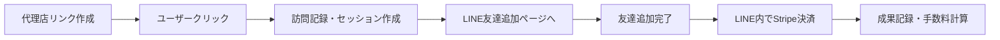

# 📊 LINE×Stripe 流入経路測定システム

## 🎯 システム概要

営業代理店が作成したトラッキングリンクから、LINE友達追加とStripe決済までの完全な成果測定を実現します。

## 🔄 トラッキングフロー



## 📝 実装内容

### 1. **トラッキングリンクの仕組み**

#### 元のLINE URL
```
https://lin.ee/4NLfSqH
```

#### 代理店用トラッキングURL
```
https://taskmateai.net/t/{tracking_code}
例: https://taskmateai.net/t/abc123xy
```

### 2. **クリック測定機能** (`/netlify/functions/track-redirect.js`)

- **訪問者情報の記録**
  - IPアドレス
  - ユーザーエージェント
  - デバイスタイプ（モバイル/PC）
  - ブラウザ情報
  - OS情報

- **セッション管理**
  - ユニークセッションID生成
  - Cookieによる追跡
  - パラメータによる属性保持

### 3. **Stripe決済の成果測定** (`/netlify/functions/stripe-webhook.js`)

- **決済イベントの処理**
  - payment_intent.succeeded
  - checkout.session.completed
  - invoice.payment_succeeded

- **手数料の自動計算**
  - 代理店ごとの手数料率適用
  - 月次集計
  - 支払い管理

### 4. **データベース連携**

```sql
-- 訪問記録
agency_tracking_visits (
    tracking_link_id,
    session_id,
    visitor_ip,
    user_agent,
    device_type
)

-- コンバージョン記録
agency_conversions (
    tracking_link_id,
    agency_id,
    conversion_type: 'stripe_payment',
    conversion_value,
    line_user_id
)

-- 手数料管理
agency_commissions (
    agency_id,
    total_sales,
    commission_amount,
    status
)
```

## 🚀 セットアップ手順

### 1. **環境変数の設定** (Netlify)

```bash
# Stripe設定
STRIPE_SECRET_KEY=sk_live_xxxxx
STRIPE_WEBHOOK_SECRET=whsec_xxxxx

# 既存の環境変数
SUPABASE_URL=https://xxxxx.supabase.co
SUPABASE_SERVICE_ROLE_KEY=xxxxx
JWT_SECRET=xxxxx
```

### 2. **Stripe Webhookの設定**

Stripeダッシュボードで以下のエンドポイントを登録:

```
https://taskmateai.net/.netlify/functions/stripe-webhook
```

**必要なイベント:**
- `payment_intent.succeeded`
- `checkout.session.completed`
- `customer.created`
- `invoice.payment_succeeded`

### 3. **Netlifyのリダイレクト設定** (`netlify.toml`)

```toml
[[redirects]]
  from = "/t/*"
  to = "/.netlify/functions/track-redirect/:splat"
  status = 200
```

## 📊 トラッキングの流れ

### Step 1: リンク作成
代理店ダッシュボードで新規リンク作成
```javascript
{
    name: "春のキャンペーン",
    line_friend_url: "https://lin.ee/4NLfSqH",
    utm_source: "agency001",
    utm_campaign: "spring_2024"
}
```

### Step 2: ユーザーアクセス
```
https://taskmateai.net/t/abc123xy
↓
記録: IPアドレス、デバイス情報、セッションID
↓
リダイレクト: https://lin.ee/4NLfSqH?tid=abc123xy&sid=sess_xxxxx&aid=agency_id
```

### Step 3: LINE内でStripe決済
```javascript
// Stripe決済時にメタデータを含める
stripe.paymentIntents.create({
    amount: 10000,
    currency: 'jpy',
    metadata: {
        line_user_id: 'U1234567890',
        tracking_code: 'abc123xy',
        session_id: 'sess_xxxxx',
        agency_id: 'agency001'
    }
});
```

### Step 4: 成果記録
Webhookで自動的に:
- コンバージョン記録
- 手数料計算（10000円 × 10% = 1000円）
- 代理店ダッシュボードに反映

## 📈 分析可能な指標

### 代理店ダッシュボードで確認できる項目

1. **基本指標**
   - クリック数
   - LINE友達追加数
   - Stripe決済数
   - 総売上

2. **コンバージョン率**
   - クリック → LINE友達追加
   - LINE友達追加 → 決済
   - 全体のCVR

3. **手数料**
   - 今月の報酬
   - 累計報酬
   - 支払い状況

## 🔒 セキュリティ

- Stripe Webhook署名検証
- JWT認証による代理店アクセス制御
- RLS（行レベルセキュリティ）によるデータ保護
- セッションベースの追跡（個人情報は保存しない）

## 🎯 メリット

1. **代理店にとって**
   - 成果の可視化
   - 自動手数料計算
   - リアルタイム分析

2. **システム運営者にとって**
   - 完全な属性追跡
   - 不正防止
   - 自動化された報酬管理

3. **エンドユーザーにとって**
   - シームレスな体験
   - プライバシー保護
   - 透明性のある追跡